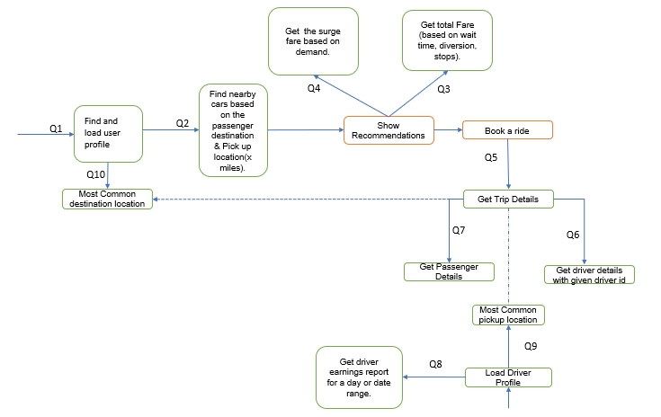

# UBER : Cassandra Query First Design

## Section: I Introduction

**Problem Statement**: In the context of Big Data, traditional relational databases face scalability and performance constraints. Uber's Ride Sharing application requires a database solution that overcomes these limitations. Therefore, to overcome the limitations of SQL databases in handling Big Data, this project focuses on a schema design using a NoSQL database called Cassandra.

**Objectives:**
The objectives of this project are the following:

- Construct a Physical Relational Data Model from a public domain ER diagram.
- Align database design with the "Query First" approach, focusing on application functionality.
- Translate the RDBMS schema into a NoSQL Cassandra database model.

**Approach:**
The following approach is adopted to reach the project objectives:

- Analyze the existing RDBMS schema derived from the ER diagram.
- Identify and prioritize queries essential for ride-sharing functionality.
- Design the Cassandra schema to efficiently address these queries.

**Outcomes:**
The following results and outcomes were obtained as a part of the Big Data Analysis:

- Develop a Cassandra schema that leverages fault tolerance, decentralization, and horizontal scaling.
- Insight into the challenges and trade-offs during the translation process from RDBMS to NoSQL.
- A final database design that showcases enhanced performance and scalability suitable for high-volume applications like Uber's Ride Sharing service.

## Section: II RDBMS Schema Analysis

The below ER diagram(figure1.1) shows the high-level design for the Uber passenger ride app, using which the Relationational modeling with the tables and the columns are built and presented in the Relational Modelling section (figure 1.2).

### Entity Relation


_Figure 1-1. Entity-relationship diagram for Uber application_

**The ER diagram depicts various entities and their relationships:**

- **Passenger Table**: Contains details about the passengers including UserID, Name, Gender, and Overall Rating.

- **Driver Table**: Stores information about the drivers, such as DriverID, Name, Gender, and Overall Rating.

- **Car Table**: Holds data on the cars, including a unique CarID, CAR VIN number, Plate Number, and a foreign key to DriverID.

- **Car Location Table**: Tracks the current locations of cars, referenced by CarID, CAR VIN number, Plate Number, and DriverID.

- **Request Table**: Represents ride requests made by passengers, detailing the RequestID, number of seats requested, ride type, pickup and drop locations, and estimated fare.

- **Trip Table**: Records details of trips, including TripID, Start Time, Duration, Fare, and Driver Rating, along with foreign keys to DriverID and RequestID.

### Relational Modelling

The below diagram is built considering the Data driven approach.


_Figure 1-2. Physical data model for Uber application_

## Section: III Query Analysis

Considering the query first approach team reviewed the fuctions and features of the Uber ride app and the flows.
Below are the use cases /queries team has designed.

#### Transaction Processing Queries

- Q1: Find and load user profile.
- Q2: Find nearby cars based on the passenger destination & Pick up location(x miles).
- Q6: Compute the surge fare based on demand.
- Q10: Compute total Fare (based on wait time, diversion, stops).
- Q3: Get Trip details based on the trip id
- Q4: Get Driver details with given driver id.
- Q5: Get Passenger details with given passsenget id.
- Q7: Get driver earnings report for a day or date range.
- Q8: Recomend most common pickup locations across all trips.
- Q9: Recomend most common destination locations across all trips.

## Below is the work-flow diagram shows the work steps for the application



_Figure 1-3. Uber Ride application queries_

## Query Analysis: A) SQL Queries to Address the Questions

-- Q1: Load customer profile for a given user_id

```
SELECT * FROM user_profiles
WHERE user_id = 111222333;
```

-- Q2: Find nearby cars based on location (requires a function or stored procedure to calculate distance)

```
DELIMITER $$

CREATE PROCEDURE nearbycars(
    IN Range DECIMAL(10,2),
    IN pax_lat DECIMAL(10,2),
    IN pax_long DECIMAL(10,2)
)
BEGIN
    SELECT car_id, driver_id,
           SQRT(
               POW(driver_location_lat - pax_lat, 2) +
               POW(driver_location_long - pax_long, 2)
           ) AS distance_to_pax
    FROM nearby_cars
    WHERE driver_location_lat BETWEEN pax_live_lat - Range AND pax_live_lat + Range
      AND driver_location_long BETWEEN pax_live_long - Range AND pax_live_long + Range
      AND is_available = TRUE
    ORDER BY distance_to_pax ASC;
END$$

DELIMITER ; -- pax_live_lat and pax_live_long come from the APP; assuming Earth is flat for short distances (for using Euclidean Geometry)

```

-- Q3: Get Trip Details for a given trip_id

```
SELECT trip_id, driver_id, car_type, estimated_drop_off_time, fare, driver_first_name, driver_last_name, driver_overall_rating
FROM trip_details
WHERE trip_id = 12233344455555;-- trip_id would come from App
```

-- Q4: Get driver details for a given driver_id

```
SELECT first_name, last_name, overall_rating, miles_driven
FROM driver_information
WHERE driver_id = 1212; -- driver_id would come from App
```

-- Q5: Get Passenger details for a given user_id

```
SELECT first_name, last_name, overall_rating, mobile_number, email
FROM passenger_details
WHERE user_id = 1111; -- driver_id would come from App
```

-- Q6: Compute the surge fare based on demand level

```
SELECT multiplier FROM surge_pricing
WHERE demand_level = 'high'; -- demand_level would come from App
```

-- Q7: Calculate Total Earnings for a driver within a date range

```
SELECT SUM(fare + tips) AS total_earnings
FROM driver_earnings
WHERE driver_id = 1122 AND start_datetime BETWEEN 0000 AND 2400; -- driver_id  would come from App
```

-- Q8: Identify the most common pickup locations for drivers

```
SELECT pickup_address, COUNT(*) AS popular_pickup_locations
FROM pickup_locations_analytics
WHERE pickup_lat BETWEEN driver_live_location_lat - Range AND driver_live_location_lat + Range
      AND pickup_long BETWEEN driver_live_location_long - Range AND driver_live_location_long + Range
GROUP BY pickup_address
ORDER BY popular_pickup_locations DESC
LIMIT 3;-- driver_live_location_lat and driver_live_location_long would come from App which would be compared with pickup_lat and pickup_long from the database
```

-- Q9: Identify the most common destination locations for passengers

```
SELECT destination_address, COUNT(*) AS popular_destinations
FROM destination_locations_analytics
WHERE destination_lat BETWEEN pax_live_location_lat - Range AND pax_live_location_lat + Range
      AND destination_long BETWEEN pax_live_location_long - Range AND pax_live_location_long + Range
GROUP BY destination_address
ORDER BY popular_destinations DESC
LIMIT 3; -- pax_live_location_lat and pax_live_location_long would come from App which would be compared with destination_lat and destination_long from the database
```

-- Q10: Calculate Fare for a trip (Assuming necessary data like tolls, tax rate, etc., are provided)

```
SELECT ((base_fare + tolls) + (estimated_distance * pricing_per_mile))*tax_rate AS total_fare
FROM fare_estimate
WHERE trip_id = 887766; -- trip_id  would come from App
```

## Cassandra Schema Design


_Figure 1-3. Cassandra Logical Datamodel_

## Query Analysis: B) CQL Queries to Address the questions

-- Q1: Load customer profile for a given user_id

```
SELECT first_name, last_name, email, mobile_number, account_type
FROM user_profiles
WHERE user_id = 111222333

```

Q2: Find nearby cars based on location(requires a function or stored procedure to calculate distance)

```
Cassandra doesn't support stored procedures, and it's not ideal for calculating distances within queries because that would require filtering across many partitions. We  should maybe pre-calculate a "geo hash" or use some bucketing strategy, but I'll provide a general CQL that assumes some form of pre-calculation has been done.

SELECT car_id, driver_id FROM nearby_cars
WHERE location_lat = ? AND location_lon = ? AND is_available = true ALLOW FILTERING;

if we use "geo hash" the query could be something like this

SELECT car_id, driver_id, driver_location_lat, driver_location_lon
FROM nearby_cars
WHERE geohash = ?
AND is_available = true;
 Note: we should replace ? with the actual geohash value that corresponds to the latitude and longitude of the passenger (this would be calculated in our application).
```

-- Q3: Get Trip Details for a given trip_id

```
SELECT trip_id, driver_id, car_type, estimated_drop_off_time, fare
FROM trip_details
WHERE trip_id = 12233344455555;
```

-- Q4: Get driver details for a given driver_id

```
SELECT first_name, last_name, overall_rating, miles_driven
FROM driver_information
WHERE driver_id = 1212;
```

-- Q5: Get Passenger details for a given user_id

```
SELECT first_name, last_name, overall_rating, mobile_number, email
FROM passenger_details
WHERE user_id = 1111;
```

-- Q6: Compute the surge fare based on demand level

```
In Cassandra, we can't filter on non-primary key columns without a secondary index or using ALLOW FILTERING. The proper way would be to ensure demand_level is part of the primary key if you want to filter on it directly. Here's the query with ALLOW FILTERING, but it should be optimized in a real-world application:

SELECT surge_factor AS multiplier
FROM surge_pricing
WHERE demand_level = 'high'
ALLOW FILTERING;

```

-- Q7: Calculate Total Earnings for a driver within a date range

```
In SQL, we can add up all the earnings for a driver over a specific period using the SUM() function.
In Cassandra, it does not allow you to sum across multiple rows from different partitions by default. This is because such an operation could potentially involve gathering data from many different nodes in the cluster, which would be very slow and inefficient.
Instead, we will have to handle this by either:

•	When we insert earnings data, we could also update a separate record (Example: Total) that keeps a running total of the earnings for each driver for the date range in question. Something like
•	I am assuming we will have a table structure to hold monthly or daily totals, we can query directly for the total earnings in a specific period.
In short : we must maintain the totals in the application layer or through Cassandra counters.

SELECT total_earnings
FROM driver_monthly_earnings
WHERE driver_id = 1122  AND year_month = '2024-04';
```

-- Q8: Identify the most common pickup locations

```
In SQL, To find the most common pickup locations we can use a GROUP BY statement along with COUNT () and ORDER BY to group records by location and count them.
In Cassandra, GROUP BY clause is available but it’s has limited functionality.
Instead
•	We could maintain a counter for each location that increments every time a pickup is made. Then we can easily query to find the highest counters, make sense?

SELECT city, province, pickups
FROM pickup_location_counters
WHERE city = 'CityName' AND province = 'ProvinceName';

```

-- Q9: Identify the most common destination locations

```
Same as in Q8, identifying the most common destination locations would require aggregation over multiple records to count occurrences.
Instead
•	Maintain counters: A counter table to keep track of the number of times a destination is used.

SELECT city, province, dropoffs
FROM destination_location_counters
WHERE city = 'CityName' AND province = 'ProvinceName';

```

-- Q10: Calculate Fare for a trip (Assuming necessary data like tolls, tax rate, etc., are provided)

```
CQL doesn't support arithmetic operations within the SELECT statement. You must fetch the individual components and perform the calculation in the application layer.

SELECT base_fare, tolls, pricing_per_mile
FROM fare_estimate
WHERE trip_id = 12233344455555;

```

## Section: IV Cassandra Schema

```
CREATE KEYSPACE Uber
WITH replication = {'class': 'SimpleStrategy', 'replication_factor' : 3};
CREATE TABLE user_profiles (
  user_id UUID PRIMARY KEY,
  account_type TEXT,
  profile_type TEXT,
  first_name TEXT,
  last_name TEXT,
  email TEXT,
  mobile_number INT
);
CREATE TABLE destination_locations_analytics (
  location_lat DOUBLE,
  location_long DOUBLE,
  city TEXT,
  province TEXT,
  postal_code INT,
  PRIMARY KEY ((location_lat, location_long))
);
CREATE TABLE nearby_cars (
  location_lat DOUBLE,
  location_long DOUBLE,
  is_available BOOLEAN,
  location_id UUID,
  car_id UUID,
  driver_id UUID,
  PRIMARY KEY ((location_lat, location_long), is_available)
) WITH CLUSTERING ORDER BY (is_available ASC);

CREATE TABLE fare_estimate (
  surge_pricing UUID,
  trip_id UUID,
  start_time TIMESTAMP,
  base_fare FLOAT,
  estimated_distance FLOAT,
  number_of_stops INT,
  diversion_length FLOAT,
  wait_time_fees FLOAT,
  car_type TEXT,
  tolls FLOAT,
  pricing_per_mile FLOAT,
  PRIMARY KEY (surge_pricing, trip_id)
);
CREATE TABLE surge_pricing (
  surge_pricing UUID PRIMARY KEY,
  demand_level TEXT,
  multiplier FLOAT --for higher precision can use DOUBLE
);
CREATE TABLE trip_details (
  trip_id UUID PRIMARY KEY,
  car_type TEXT,
  user_id UUID,
  driver_id UUID,
  car_id UUID,
  start_datetime TIMESTAMP,
  estimated_drop_off_time TIMESTAMP,
  fare FLOAT,
  driver_first_name TEXT,
  driver_last_name TEXT,
  driver_overall_rating FLOAT,
  pickup_lat DOUBLE,
  pickup_long DOUBLE,
  drop_lat DOUBLE,
  drop_long DOUBLE,
  post_trip_fare FLOAT
);
CREATE TABLE pickup_locations_analytics (
  pick_location_lat DOUBLE,
  pick_location_long DOUBLE,
  destination_address TEXT,
  trip_id UUID,
  city TEXT,
  province TEXT,
  postal_code INT,
  PRIMARY KEY ((pick_location_lat, pick_location_long))
);
CREATE TABLE driver_information (
  driver_id UUID PRIMARY KEY,
  overall_rating FLOAT,
  first_name TEXT,
  last_name TEXT,
  dl_number TEXT,
  miles_driven FLOAT
);
CREATE TABLE passenger_details (
  user_id UUID PRIMARY KEY,
  overall_rating FLOAT,
  first_name TEXT,
  last_name TEXT,
  mobile_number INT,
  email TEXT
);
CREATE TABLE driver_earnings (
  driver_id UUID,
  start_datetime TIMESTAMP,
  trip_id UUID,
  tips FLOAT,
  fare FLOAT,
  PRIMARY KEY (driver_id, start_datetime)
) WITH CLUSTERING ORDER BY (start_datetime DESC);

```

## Section: V Discussion

## Section: VI Conclusion
