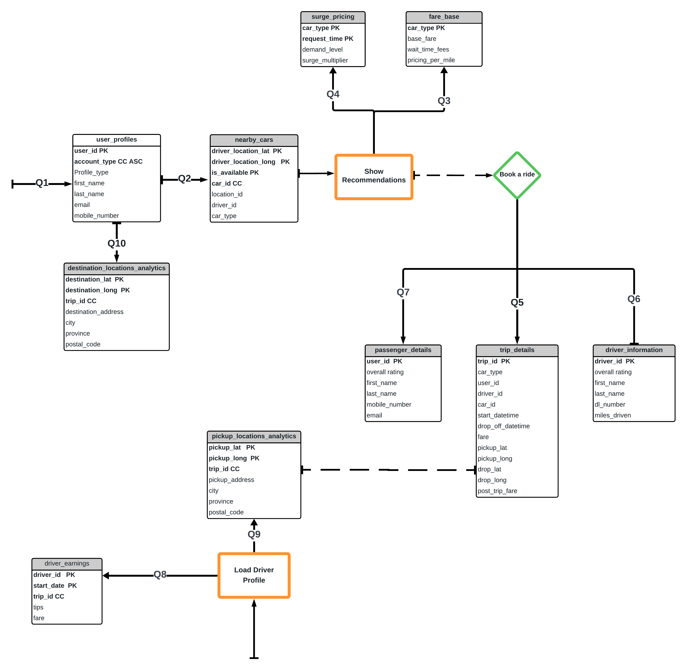

# UBER : Cassandra Query First Design

## Introduction
In this group project team is analysing the Uber's Ride Sharing application and all the relational data models for a passenger to book a ride. The first objective here is to build the Physical Relational Data model based on the sample ER diagram obtained from the public domain. Team also put together the applicaiton requirements considering application function and Query first design. Using those Queries team has designed the Data base with a NoSQL Database- Cassandra. 
In the next sections of this document detailed step by step processes and steps  followed are explained.

## RDBMS Schema Analysis
The below ER diagram(figure1.1) show the high level design for the Uber passenger ride app, using which the Relationational modeling with the tables and the columns are built and presented in Relational Modelling section (figure 1.2).
### Entity Relation


_Figure 1-1. Entity-relationship diagram for Uber application_

### Relational Modelling
The below diagram is built considering the Data driven approach.


_Figure 1-2. Physical data model for Uber application_

## Query Analysis
Considering the query first approach team reviewed the fuctions and features of the Uber ride app and the flows. 
Below are the use cases /queries team has designed. 

#### Transaction Processing Queries

- Q1: Load customer profile and allow user to select business or personal accounts.
- Q2: Find nearby cars based on the passenger destination & Pick up location(x miles).
- Q3: Get Trip Details based on the Trip ID (How far is the driver, Confirmation number, Driver Name & Rating, Type of car, Drop off time,Fare)
- Q4: (Passenger checking Driver information) get driver details with given driver id(Rating, miles driven)
- Q5: Get Passenger details (Passenger ID, his rating).
- Q6: Compute the surge fare based on factors demand.
- Q7: Total Earnings per (day/date Range) for a given driver (driver id)
- Q8: What are the most common pickup locations across all trips?
- Q9: What are the most common destination locations across all trips?
- Q10: Calculate Fare (based on wait time, diversion, stops)

  


_Figure 1-3. Uber Ride application queries_


## Below work flow diagram shows the worksteps for the applicaiton

## Cassandra Schema Design


_Figure 1-3. Cassandra Logical Datamodel_


## SQL Queries to Address the questions

-- Q1: Load customer profile for a given user_id
```
SELECT first_name, last_name, email, mobile_number, account_type
FROM user_profiles
WHERE user_id = ?;

-- Q2: Find nearby cars based on location (requires a function or stored procedure to calculate distance)
SELECT car_id, driver_id
FROM nearby_cars
WHERE location_lat = ? AND location_lon = ? AND is_available = true;

-- Q3: Get Trip Details for a given trip_id
SELECT trip_id, driver_id, car_type, estimated_drop_off_time, fare, driver_first_name, driver_last_name, driver_overall_rating
FROM trip_details
WHERE trip_id = ?;

-- Q4: Get driver details for a given driver_id
SELECT first_name, last_name, overall_rating, miles_driven
FROM driver_information
WHERE driver_id = ?;

-- Q5: Get Passenger details for a given user_id
SELECT first_name, last_name, overall_rating, mobile_number, email
FROM passenger_details
WHERE user_id = ?;

-- Q6: Compute the surge fare based on demand level
SELECT multiplier
FROM surge_pricing
WHERE demand_level = ?;

-- Q7: Calculate Total Earnings for a driver within a date range
SELECT SUM(fare + tips) AS total_earnings
FROM driver_earnings
WHERE driver_id = ? AND start_datetime BETWEEN ? AND ?;

-- Q8: Identify the most common pickup locations
SELECT city, province, COUNT(*) AS total_pickups
FROM pickup_locations_analytics
GROUP BY city, province
ORDER BY total_pickups DESC
LIMIT 1;

-- Q9: Identify the most common destination locations
SELECT city, province, COUNT(*) AS total_destinations
FROM destination_locations_analytics
GROUP BY city, province
ORDER BY total_destinations DESC
LIMIT 1;

-- Q10: Calculate Fare for a trip (Assuming necessary data like tolls, tax rate, etc., are provided)
SELECT (base_fare + tolls + (tax_rate * (base_fare + tolls)) + (estimated_distance * pricing_per_mile)) AS total_fare
FROM fare_estimate
WHERE trip_id = ?;

## Discussion

## Conclusion
