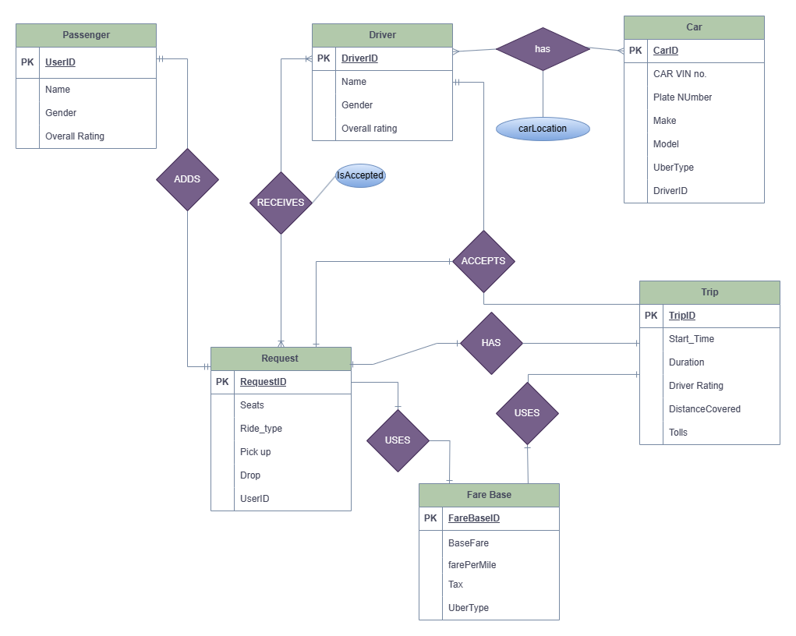

# UBER : Cassandra Query First Design

## Section: I Introduction

**Problem Statement**: In the context of Big Data, traditional relational databases face scalability and performance constraints. Uber's Ride Sharing application requires a database solution that overcomes these limitations. Therefore, to overcome the limitations of SQL databases in handling Big Data, this project focuses on a schema design using a NoSQL database called Cassandra.

**Objectives:**
The objectives of this project are the following:

- Construct a Physical Relational Data Model from a public domain ER diagram.
- Align database design with the "Query First" approach, focusing on application functionality.
- Translate the RDBMS schema into a NoSQL Cassandra database model.

**Approach:**
The following approach is adopted to reach the project objectives:

- Analyze the existing RDBMS schema derived from the ER diagram.
- Identify and prioritize queries essential for ride-sharing functionality.
- Design the Cassandra schema to efficiently address these queries.

**Outcomes:**
The following results and outcomes were obtained as a part of the Big Data Analysis:

- Develop a Cassandra schema that leverages fault tolerance, decentralization, and horizontal scaling.
- Insight into the challenges and trade-offs during the translation process from RDBMS to NoSQL.
- A final database design that showcases enhanced performance and scalability suitable for high-volume applications like Uber's Ride Sharing service.

## Section: II RDBMS Schema Analysis

The below ER diagram (Figure 1-1) shows the high-level design for the Uber passenger ride app, using which the Relationational modeling with the tables and the columns are built and presented in the Relational Modelling section (Figure 1-2).

### Entity Relation



_Figure 1-1. Entity-relationship diagram for Uber application_

**The ER diagram depicts various entities and their relationships:**

**Passenger Table**: This table captures the details of the users who utilize the ride service, identifiable by a unique UserID (Primary Key). It includes fields for the Name, Gender, and an Overall Rating given to them by drivers.

**Driver Table:** Holds records for individuals who drive for the service. Each driver has a unique DriverID (Primary Key) and the table stores their Name, Gender, and an Overall Rating based on feedback from passengers.

**Car Table**: Details the vehicles available for the ride service, each assigned a unique CarID (Primary Key). It includes the CAR VIN number, Plate Number, and other descriptors like Make, Model, and UberType. Each car is linked to a driver via a DriverID .

**Request Table:** Captures ride requests from passengers, identified by a unique RequestID (Primary Key). It contains the number of Seats required, the Ride_type, locations for Pick up and Drop, and associates each request with a passenger through UserID .

**Trip Table**: Logs completed trips, each identified by a unique TripID (Primary Key). It records the Start_Time, Duration of the trip, the Driver Rating given post-ride, the DistanceCovered, and any Tolls paid. It associates each trip with the driver through DriverID .

**Fare Base Table**: Maintains the fare structure, identified by fareBaseId (Primary Key). It includes the BaseFare, cost farePerMile, applicable Tax, and is associated with a specific UberType.

### Assumptions and Constraints

- **Assumptions**: Each entity is uniquely identified by its primary key. Relationships are managed through foreign keys, ensuring data integrity across transactions.
- **Data Integrity**: Enforced by primary and foreign keys, along with not null and unique constraints that ensure the accuracy and uniqueness of data entries.
- **Normalization**: The schema adheres to the third normal form to minimize redundancy and dependencies.

### Relational Modelling

The below diagram is built considering the Data driven approach.


_Figure 1-2. System Design for Uber application_

## Section: III Query Analysis

In the dynamic world of ride-sharing applications, quick and reliable access to data is key to a smooth experience for both riders and drivers. To build an application that meets these needs, our team has carefully considered which queries are most important for its operation. This isn't just about making sure we can show users the information they want when they want it; it's about laying the foundation for our database design. With Cassandra as our chosen database, we start with the queries first to make sure we're setting it up in a way that will be fast, efficient, and scalable. These queries form the core of the application’s functionality, driving the interaction between passengers and drivers. To design an efficient schema for a distributed database like Cassandra, it is essential to identify and analyze these key queries.Here, we present the essential queries that will drive the functionality of our application, ensuring users can find rides, get fare estimates, and drivers can manage their earnings effectively.

### Queries

Below is a detailed analysis of the queries and their significance in the application workflow where a passenger is requesting a ride from pick up location to a destination location using Uber rideshare app. The passenger is looking for various options such as nearest pickup location / shortest pickup time along with the cheapest fare.

**Q1: Find and load user profile.**

- This step involves retrieving the profile details of a user which includes personal information, ride history, and preferences.

**Q2: Find nearby cars based on the passenger destination & pick up location.**

- This query searches for available cars that are near the passenger's current location or given pickup location.

**Q3: Get the total Fare (based on wait time, diversion, stops).**

- This query calculates the total fare of a ride.

**Q4: Get the surge fare based on demand.**

- When demand for rides is high, surge pricing may be applied. This step gets the surge multiplier based on the time and the Uber type.

**Q5: Get Trip details based on the trip id**

- Once the trip is booked the user and the drivers can retrieve the information about the particular trip. It contains information like trip confirmation number, driver details, car details, pickup time, and location. It also has the trip fare.

**Q6: Get Driver details with given driver id.**

- Passenger uses this feature to view the driver details.

**Q7: Get Passenger details with given passenger id.**

- Driver uses this feature to view the passenger details.

**Q8: Get driver earnings report for a day or date range.**

- This is a report generated for drivers to view their earnings over a specified period, such as a day or a set range of dates.

**Q9: Recommend most common pickup locations across all trips.**

- This query is used by the driver to identify the most common pickup locations in the nearby vicinity where frequency of passenger availability is high.

**Q10: Recommend most common destination locations across all trips.**

- This feature is for the passengers to identify nearby popular destinations based on the frequency of past visits. This can also be used for analytical purposes.

### Additional Essential Queries

While the core queries outlined earlier are fundamental to our application's primary functions, the inclusion of supplementary queries is imperative for a well-rounded feature set and insightful analytics:

**Passenger Ride Request Status:**

Monitor the status of passenger ride requests, including pending, accepted, en-route, and completed states.

**Real-Time Ride Tracking:**

Provide real-time updates on the ride's progress, ensuring both passenger and driver are informed throughout the journey.

**Feedback and Rating System:**

Capture the post-ride feedback from both drivers and passengers to maintain service quality and trust.

**Dynamic Route Optimization:**

Optimize the route during the trip based on current traffic conditions to reduce travel time and enhance user satisfaction.

## Section: IV Cassandra Schema

### Design

For ridesharing applications like Uber, timely and reliable data access is crucial for an optimal user experience for both riders and drivers. Based on the functional design of the Uber application for the passengers and drivers, a foundational database is designed. Query first design approach is chosen to display necessary information to both passenger and drivers. Cassandra has been selected as the database due to its ability to handle the required queries efficiently and scale effectively. The outlined queries are designed to enhance the application's core functions, such as ride-finding, fare estimation, and driver earnings management.


_Figure 1-3. Cassandra Logical Datamodel_

Here's how the "Query First" design philosophy impacts schema design for the given queries:

**Find and load user profile (Q1):**

RDBMS: User profiles would be stored in a users table, likely indexed by a user ID.

Cassandra: The table is designed with the query in mind. If the primary query is to fetch user details by user ID, the user ID becomes the partition key. No joins are required as denormalization is expected.

**Find nearby cars based on passenger destination & pick up location (Q2):**

RDBMS: This would involve a spatial query joining a locations table and cars table.

Cassandra: A geospatial index is not natively supported, so we often pre-calculate "grid cells" or "zones" and use those as partition keys. Queries are made against a table partitioned by these zones.

**Get the total Fare (Q3):**

RDBMS: Would aggregate fare components on the fly, possibly using a view or stored procedure.

Cassandra: Pre-compute fare and store it in a denormalized form, fetching directly without the need for complex transactions or joins.

**Get the surge fare based on demand (Q4):**

RDBMS: Might use a complex query with possibly real-time computation based on demand.

Cassandra: Store pre-computed surge prices in a table, looked up by demand level or time period as the partition key.

**Get Trip details based on the trip id (Q5):**

RDBMS: A trips table with a primary key of trip_id would suffice.

Cassandra: Direct lookup by trip_id, with all details denormalized in the trip details table.

**Get Driver details with given driver id (Q6):**

RDBMS: A drivers table with a primary key of driver_id.

Cassandra: Similar to the RDBMS, but with no need for joins to fetch related information.

**Get Passenger details with given passenger id (Q7):**

RDBMS: Similar to users table, indexed by passenger_id.

Cassandra: Same approach as drivers; direct lookup by user_id, which is equivalent to passenger_id.

**Get driver earnings report for a day or date range (Q8):**

RDBMS: Would typically use date functions on a datetime column.

Cassandra: Pre-calculate daily earnings and store them with a partition key of driver_id and a clustering column of the date.

**Recommend most common pickup locations (Q9) and destination locations (Q10):**

RDBMS: Uses a GROUP BY on the locations with a COUNT to find the most common locations.

Cassandra: Store counters in tables where location is the partition key, incremented with each trip.

**Recommend most common destination locations (Q10):**
RDBMS: User profiles would be stored in a users table, likely indexed by a user ID.

Cassandra: The table is designed with the query in mind. If the primary query is to fetch user details by user ID, the user ID becomes the partition key. No joins are required as denormalization is expected.

### Schema

```
CREATE KEYSPACE Uber_ridesharing
WITH replication = {'class': 'SimpleStrategy', 'replication_factor' : 3};
CREATE TABLE Uber_ridesharing.user_profiles (
  user_id UUID,
  account_type TEXT,
  profile_type TEXT,
  first_name TEXT,
  last_name TEXT,
  email TEXT,
  mobile_number INT,
  PRIMARY KEY ((user_id), account_type)
) WITH CLUSTERING ORDER BY (account_type ASC);

CREATE TABLE Uber_ridesharing.nearby_cars (
  driver_location_lat DOUBLE,
  driver_location_long DOUBLE,
  is_available BOOLEAN,
  location_id UUID,
  car_id UUID,
  driver_id UUID,
  PRIMARY KEY ((driver_location_lat, driver_location_long,is_available), car_id)
);

CREATE TABLE Uber_ridesharing.fare_base (
  car_type UUID,
  base_fare FLOAT,
  wait_time_fees FLOAT,
  pricing_per_mile FLOAT,
  PRIMARY KEY (car_type)
);

CREATE TABLE Uber_ridesharing.surge_pricing (
  car_type UUID,
  request_time TIME,
  demand_level TEXT,
  surge_multiplier FLOAT,
  PRIMARY KEY (car_type,request_time)
);

CREATE TABLE Uber_ridesharing.trip_details (
  trip_id UUID,
  car_type TEXT,
  user_id UUID,
  driver_id UUID,
  car_id UUID,
  start_date_time TIMESTAMP,
  drop_off_date_time TIMESTAMP,
  fare FLOAT,
  driver_overall_rating FLOAT,
  pickup_lat DOUBLE,
  pickup_long DOUBLE,
  drop_lat DOUBLE,
  drop_long DOUBLE,
  post_trip_fare FLOAT,
  PRIMARY KEY (trip_id)
);

CREATE TABLE Uber_ridesharing.driver_information (
  driver_id UUID,
  overall_rating FLOAT,
  first_name TEXT,
  last_name TEXT,
  dl_number TEXT,
  miles_driven FLOAT,
  PRIMARY KEY (driver_id)
);

CREATE TABLE Uber_ridesharing.passenger_details (
  user_id UUID,
  overall_rating FLOAT,
  first_name TEXT,
  last_name TEXT,
  mobile_number INT,
  email TEXT,
  PRIMARY KEY (user_id)
);

CREATE TABLE Uber_ridesharing.driver_earnings (
  driver_id UUID,
  start_date TIMESTAMP,
  trip_id UUID,
  tips FLOAT,
  fare FLOAT,
  PRIMARY KEY ((driver_id, start_date),trip_id)
) ;

CREATE TABLE Uber_ridesharing.pickup_locations_analytics (
  pick_location_lat DOUBLE,
  pick_location_long DOUBLE,
  pickup_address TEXT,
  trip_id UUID,
  city TEXT,
  province TEXT,
  postal_code INT,
  PRIMARY KEY ((pick_location_lat, pick_location_long),trip_id)
);

CREATE TABLE Uber_ridesharing.destination_locations_analytics (
  location_lat DOUBLE,
  location_long DOUBLE,
  destination_address TEXT,
  trip_id UUID,
  city TEXT,
  province TEXT,
  postal_code INT,
  PRIMARY KEY ((location_lat, location_long),trip_id)
);

```

## Section: V Discussion

The project successfully transitioned the relational data model from an ER diagram to a Cassandra-based NoSQL schema, emphasizing the "Query First" design approach. Throughout the project, several key observations and challenges were noted:

### Design Philosophies:

The shift from a normalized relational database model to a denormalized Cassandra model required a fundamental change in thinking. Instead of focusing on data relationships and integrity, the priority shifted towards building query access patterns and gain optimum performance.

### Scalability and Performance:

By using query first approach the Cassandra schema is structured. The design effectively supports high scalability and performance. This approach allows Uber's ride-sharing service to handle large volumes of data transactions distributed across multiple nodes, which is crucial for real-time applications.

### Trade-offs:

The transition from RDBMS to NoSQL (using Cassandra) involves trade-offs, particularly in terms of transactional consistency and data redundancy. While Cassandra enhances availability and partition tolerance, it does so at the expense of strong consistency. Moreover, data redundancy increases due to denormalization, which can lead to higher storage requirements and can potentially lead to consistency issues.

### Application Functionality:

Aligning the database design with high in-demand application queries ensures that the database efficiently supports the core functionalities of the Uber ride-sharing application, such as real-time ride tracking, fare calculations, and efficient matching of drivers and passengers.

### Challenges in NoSQL (Cassandra) Implementation:

Working with cassandra poses challenges, particularly in handling complex queries that are typically straightforward in SQL databases, such as joins and complex aggregations. Designing the schema to efficiently support these operations requires creative strategies like carefully designed partition keys.

Overall, the project illuminated the intricacies of using a NoSQL database like Cassandra in a real-world, high-demand application. It also highlighted the importance of a detailed query analysis to drive schema design, ensuring that the database aligns with application requirements and performance expectations.

## Section: VI Conclusion

This project demonstrated the effective application of the "Query First" design philosophy in transitioning Uber's ride-sharing service to a Cassandra NoSQL database. The new schema supports enhanced performance and scalability, addressing the critical needs of handling Big Data in a real-time operational environment.

Key achievements include:

- Successful translation of an RDBMS schema to a NoSQL Cassandra model.
- Improved handling of dynamic, high-volume data transactions across a distributed nodes.
- Alignment of database functionality with core business operations, optimizing for common queries to enhance user experience.

### Future Directions:

Continuous monitoring and optimization of the schema as new queries and data access patterns emerge.Incremental improvements in data consistency mechanisms while maintaining the high availability and performance that Cassandra offers.The shift to a denormalized data model will influence how data is managed, updated, and maintained, requiring a robust strategy for handling data mutations.

In conclusion, this project not only supports the operational needs of Uber's ride-sharing platform but also serves as a valuable case study for similar applications looking to leverage NoSQL solutions for Big Data challenges.

## Section: VII Appendix

### Draft SQL Queries to Address the Questions

-- Q1: Load customer profile for a given user_id

```
SELECT * FROM user_profiles
WHERE user_id = 111222333;
```

-- Q2: Find nearby cars based on location (requires a function or stored procedure to calculate distance)

```
DELIMITER $$

CREATE PROCEDURE nearbycars(
    IN Range DECIMAL(10,2),
    IN pax_lat DECIMAL(10,2),
    IN pax_long DECIMAL(10,2)
)
BEGIN
    SELECT car_id, driver_id,
           SQRT(
               POW(driver_location_lat - pax_lat, 2) +
               POW(driver_location_long - pax_long, 2)
           ) AS distance_to_pax
    FROM nearby_cars
    WHERE driver_location_lat BETWEEN pax_live_lat - Range AND pax_live_lat + Range
      AND driver_location_long BETWEEN pax_live_long - Range AND pax_live_long + Range
      AND is_available = TRUE
    ORDER BY distance_to_pax ASC;
END$$

DELIMITER ; -- pax_live_lat and pax_live_long come from the APP; assuming Earth is flat for short distances (for using Euclidean Geometry)

```

-- Q3: Get Trip Details for a given trip_id

```
SELECT trip_id, driver_id, car_type, estimated_drop_off_time, fare, driver_first_name, driver_last_name, driver_overall_rating
FROM trip_details
WHERE trip_id = 12233344455555;-- trip_id would come from App
```

-- Q4: Get driver details for a given driver_id

```
SELECT first_name, last_name, overall_rating, miles_driven
FROM driver_information
WHERE driver_id = 1212; -- driver_id would come from App
```

-- Q5: Get Passenger details for a given user_id

```
SELECT first_name, last_name, overall_rating, mobile_number, email
FROM passenger_details
WHERE user_id = 1111; -- driver_id would come from App
```

-- Q6: Compute the surge fare based on demand level

```
SELECT multiplier FROM surge_pricing
WHERE demand_level = 'high'; -- demand_level would come from App
```

-- Q7: Calculate Total Earnings for a driver within a date range

```
SELECT SUM(fare + tips) AS total_earnings
FROM driver_earnings
WHERE driver_id = 1122 AND start_datetime BETWEEN 0000 AND 2400; -- driver_id  would come from App
```

-- Q8: Identify the most common pickup locations for drivers

```
SELECT pickup_address, COUNT(*) AS popular_pickup_locations
FROM pickup_locations_analytics
WHERE pickup_lat BETWEEN driver_live_location_lat - Range AND driver_live_location_lat + Range
      AND pickup_long BETWEEN driver_live_location_long - Range AND driver_live_location_long + Range
GROUP BY pickup_address
ORDER BY popular_pickup_locations DESC
LIMIT 3;-- driver_live_location_lat and driver_live_location_long would come from App which would be compared with pickup_lat and pickup_long from the database
```

-- Q9: Identify the most common destination locations for passengers

```
SELECT destination_address, COUNT(*) AS popular_destinations
FROM destination_locations_analytics
WHERE destination_lat BETWEEN pax_live_location_lat - Range AND pax_live_location_lat + Range
      AND destination_long BETWEEN pax_live_location_long - Range AND pax_live_location_long + Range
GROUP BY destination_address
ORDER BY popular_destinations DESC
LIMIT 3; -- pax_live_location_lat and pax_live_location_long would come from App which would be compared with destination_lat and destination_long from the database
```

-- Q10: Calculate Fare for a trip (Assuming necessary data like tolls, tax rate, etc., are provided)

```
SELECT ((base_fare + tolls) + (estimated_distance * pricing_per_mile))*tax_rate AS total_fare
FROM fare_estimate
WHERE trip_id = 887766; -- trip_id  would come from App
```

### Draft CQL Queries to Address the questions

-- Q1: Load customer profile for a given user_id

```
SELECT first_name, last_name, email, mobile_number, account_type
FROM user_profiles
WHERE user_id = 111222333

```

Q2: Find nearby cars based on location(requires a function or stored procedure to calculate distance)

```
Cassandra doesn't support stored procedures, and it's not ideal for calculating distances within queries because that would require filtering across many partitions. We  should maybe pre-calculate a "geo hash" or use some bucketing strategy, but I'll provide a general CQL that assumes some form of pre-calculation has been done.

SELECT car_id, driver_id FROM nearby_cars
WHERE location_lat = ? AND location_lon = ? AND is_available = true ALLOW FILTERING;

if we use "geo hash" the query could be something like this

SELECT car_id, driver_id, driver_location_lat, driver_location_lon
FROM nearby_cars
WHERE geohash = ?
AND is_available = true;
 Note: we should replace ? with the actual geohash value that corresponds to the latitude and longitude of the passenger (this would be calculated in our application).
```

-- Q3: Get Trip Details for a given trip_id

```
SELECT trip_id, driver_id, car_type, estimated_drop_off_time, fare
FROM trip_details
WHERE trip_id = 12233344455555;
```

-- Q4: Get driver details for a given driver_id

```
SELECT first_name, last_name, overall_rating, miles_driven
FROM driver_information
WHERE driver_id = 1212;
```

-- Q5: Get Passenger details for a given user_id

```
SELECT first_name, last_name, overall_rating, mobile_number, email
FROM passenger_details
WHERE user_id = 1111;
```

-- Q6: Compute the surge fare based on demand level

```
In Cassandra, we can't filter on non-primary key columns without a secondary index or using ALLOW FILTERING. The proper way would be to ensure demand_level is part of the primary key if you want to filter on it directly. Here's the query with ALLOW FILTERING, but it should be optimized in a real-world application:

SELECT surge_factor AS multiplier
FROM surge_pricing
WHERE demand_level = 'high'
ALLOW FILTERING;

```

-- Q7: Calculate Total Earnings for a driver within a date range

```
In SQL, we can add up all the earnings for a driver over a specific period using the SUM() function.
In Cassandra, it does not allow you to sum across multiple rows from different partitions by default. This is because such an operation could potentially involve gathering data from many different nodes in the cluster, which would be very slow and inefficient.
Instead, we will have to handle this by either:

•	When we insert earnings data, we could also update a separate record (Example: Total) that keeps a running total of the earnings for each driver for the date range in question. Something like
•	I am assuming we will have a table structure to hold monthly or daily totals, we can query directly for the total earnings in a specific period.
In short : we must maintain the totals in the application layer or through Cassandra counters.

SELECT total_earnings
FROM driver_monthly_earnings
WHERE driver_id = 1122  AND year_month = '2024-04';
```

-- Q8: Identify the most common pickup locations

```
In SQL, To find the most common pickup locations we can use a GROUP BY statement along with COUNT () and ORDER BY to group records by location and count them.
In Cassandra, GROUP BY clause is available but it’s has limited functionality.
Instead
•	We could maintain a counter for each location that increments every time a pickup is made. Then we can easily query to find the highest counters, make sense?

SELECT city, province, pickups
FROM pickup_location_counters
WHERE city = 'CityName' AND province = 'ProvinceName';

```

-- Q9: Identify the most common destination locations

```
Same as in Q8, identifying the most common destination locations would require aggregation over multiple records to count occurrences.
Instead
•	Maintain counters: A counter table to keep track of the number of times a destination is used.

SELECT city, province, dropoffs
FROM destination_location_counters
WHERE city = 'CityName' AND province = 'ProvinceName';

```

-- Q10: Calculate Fare for a trip (Assuming necessary data like tolls, tax rate, etc., are provided)

```
CQL doesn't support arithmetic operations within the SELECT statement. You must fetch the individual components and perform the calculation in the application layer.

SELECT base_fare, tolls, pricing_per_mile
FROM fare_estimate
WHERE trip_id = 12233344455555;

```
