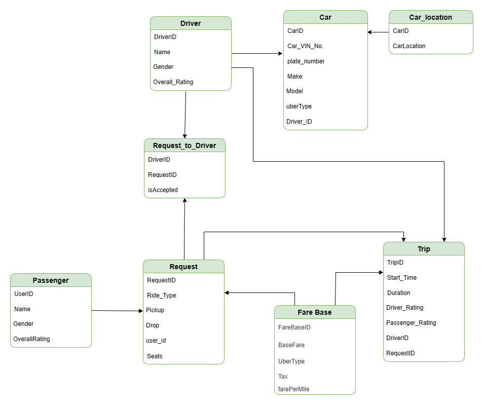

# UBER : Cassandra Query First Design

## Introduction
In this group project team is analysing the Uber's Ride Sharing application and all the relational data models for a passenger to book a ride. The first objective here is to build the Physical Relational Data model based on the sample ER diagram obtained from the public domain. Team also put together the applicaiton requirements considering application function and Query first design. Using those Queries team has designed the Data base with a NoSQL Database- Cassandra. 
In the next sections of this document detailed step by step processes and steps  followed are explained.

## RDBMS Schema Analysis
The below ER diagram(figure1.1) show the high level design for the Uber passenger ride app, using which the Relationational modeling with the tables and the columns are built and presented in Relational Modelling section (figure 1.2).
### Entity Relation

_Figure 1-1. Entity-relationship diagram for Uber application_

### Relational Modelling
The below diagram is built considering the Data driven approach.

_Figure 1-2. Physical data model for Uber application_

## Query Analysis
Considering the query first approach team reviewed the fuctions and features of the Uber ride app and the flows. 
Below are the use cases /queries team has designed. 

#### Transaction Processing Queries

- Q1: Load customer profile and allow user to select business or personal accounts.
- Q2: Find nearby cars based on the passenger destination & Pick up location(x miles).
- Q3: Get Trip Details based on the Trip ID(How far is the driver, Confirmation number, Driver Name & Rating, Type of car, Drop off time,Fare)
- Q4: (Passenger checking Driver information) get driver details with given driver id(Rating, miles driven)
- Q5: Get Passenger details (Passenger ID, his rating).
- Q6: Compute the surge fare based on factors demand.
- Q7: How many miles 
  

_Figure 1-3. Uber Ride application queries_

#### Analytical Queries

- Q7 (Compute Passenger rating) get all the past trips for a given Passenger 
-
- Q9 (Drive view, revenue): get total sum of revenue of given day
  (Company view, revenue): get total sum of revenue of given day, time slot, area

- Q11: How many trips has a passenger made within a certain time period?
- Q12: What is the average rating of a driver based on completed trips?
- Q13: What types of payment methods does a passenger use most frequently?
- Q14: Which cars (make and model) are most used by a particular driver?
- Q15: What is the average fare and tip size for trips of a particular ride type?
- Q16: How many rides have a driver canceled over the last year, and what were the penalties?
- Q17: For which rides did passengers leave rating, and what were those rating?
- Q18: What is the total fare generated by a particular car (identified by VIN) over its lifetime of service? --
- Q19: Can we list all drivers who have not driven in the past month?
- Q20: What are the most common pickup locations across all trips?
## Below work flow diagram shows the worksteps for the applicaiton

## Cassandra Schema Design

_Figure 1-1. Cassandra diagram_

## Discussion

## Conclusion
