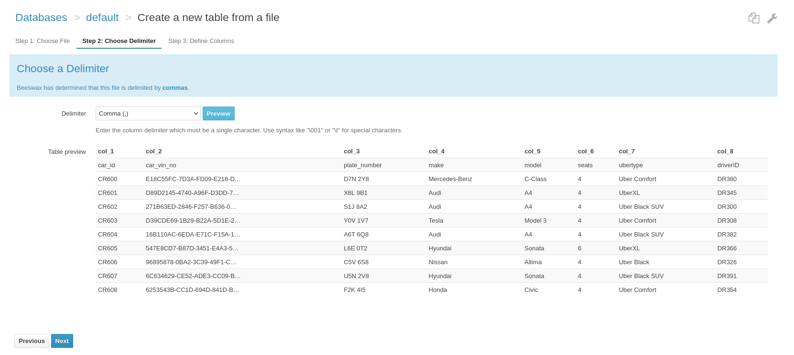
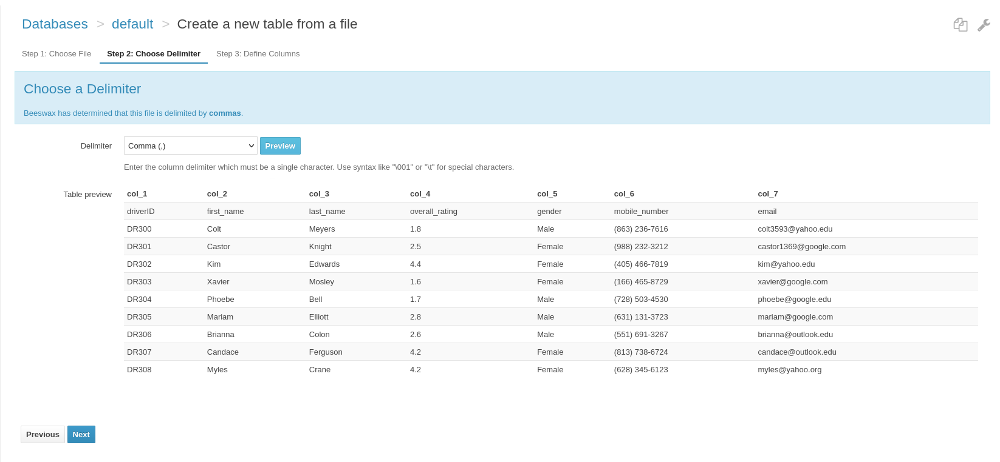
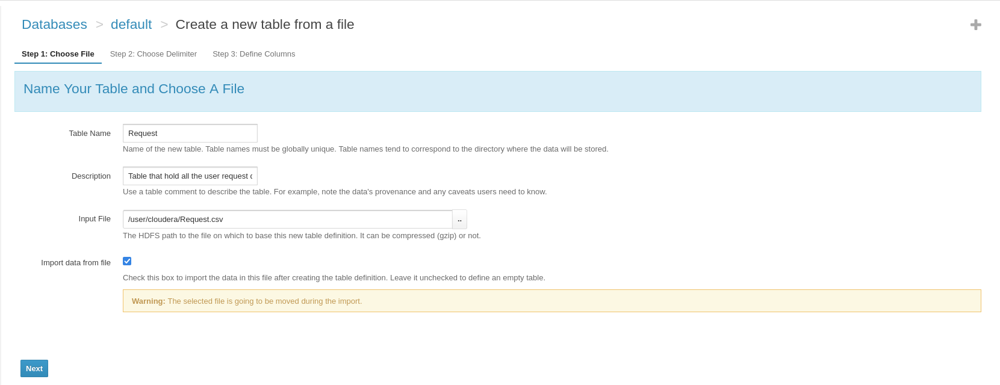
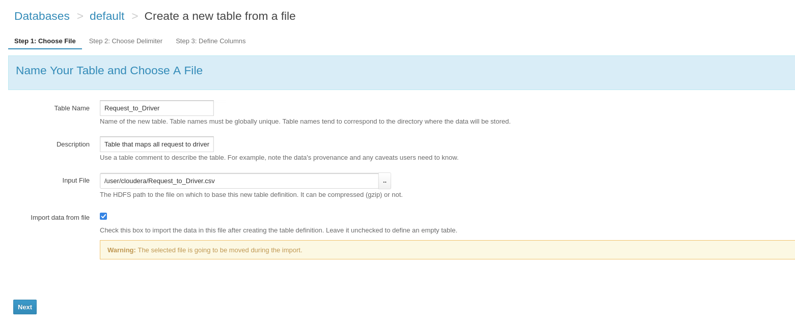
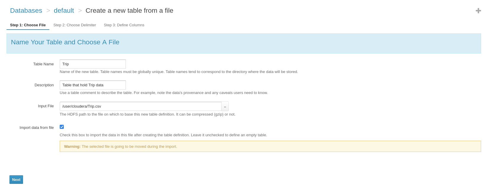

# UBER Ride Sharing App (Hive Approach)
## Section: I Introduction
**Introduction to Apache Hive**

Apache Hive is a robust data warehousing solution built atop the Apache Hadoop ecosystem, originally developed by Facebook (2008). Hive facilitates easy querying, data summarization, and analysis of vast datasets distributed across a Hadoop Distributed File System. HiveQL syntactically is like SQL allowing SQL-knowledgeable users to transition into big data roles. HiveQL converts the queries into MapReduce jobs, making it ideal for querying data in a distributed environment.    

**Overview of Apache Hive**

Hive is tailored for handling structured data on HDFS (Hadoop Distributed File System) and excels at scalable data processing. While Hive is not geared towards real-time querying, it is highly effective for batch processing large volumes of data. Its SQL-like interface allows for complex analytical queries, which makes Hive a fundamental tool in big data analytics.

**Relevance to Big Data**

Handling big data involves challenges like managing large volumes of data, ensuring quick data processing, and accommodating various data types. Hive addresses these through its ability to manage petabytes of data and its scalable architecture, which supports efficient parallel processing across multiple servers.

**Project Purpose: Hive Implementation**

The project's goal is to translate a traditional RDBMS schema and RDBMS queries into Apache Hive query language. This further helps in obtaining hands-on experience of Hive's data warehousing capabilities using Cloudera supported Hive environment.

**Optimization Techniques:**
Query optimization techniques include bucketing based on hash function, partitioning based on column values, join optimization like placing larger table first, denormalization of data by avoiding joins, allocating required memory for the map-reduce tasks based on the data size, etc.   


**Performance and Scalability Analysis (Hive vs Cassandra)**

There are fundamental differences b/w Hive and Cassandra. Hive is a Table-oriented, inspired by traditional RDBMS concepts. Data is structured into tables with schemas. Cassandra on the other hand is a wide-column store (key-value oriented). Data is organized into rows identified by a key, and columns within a row can be dynamic. Hive utilizes Batch-oriented analytics over large, historical datasets. Cassandra is optimized for high-write throughput, fast reads, and real-time data scenarios.


## Section: II Schema Implementation in Hive
Like RDBMS schema, Hive requires a table schema to be first updated in Hive prior to uploading the data. However, the data format may or may not be like that in the RDBMS schema.

### HiveQL Implementation Steps (Create Tables and Data Type Choices):
A sample table using the Create Statement in Hive is shown below (note, for the current project purpose, Cloudera Hive interface is used to upload the data into the Hive Database).

````sql
CREATE TABLE Passenger (
    requestID STRING,
    ride_type STRING,
    pickup_lat FLOAT,
    pickup_long FLOAT,
    pickup_address STRING,
    drop_lat FLOAT,
    drop_long FLOAT,
    seats TINYINT,
    userID STRING
)
ROW FORMAT DELIMITED
FIELDS TERMINATED BY ','
STORED AS TEXTFILE;

````
This statement sets up a table that matches the columns of the RDBMS schema. A text-based storage format is chosen, using commas as delimiters, which is frequently used for importing data from CSV files

**Populating the Database:**  
With the schema structure defined in Hive, the next step is importing the data from a CSV file into Hive. The HiveQL interface allows you to specify the delimiter and preview the data import for accuracy.

#### Table: Passenger
This table holds all the passenger information. For instance, passenger name, location, ratings, etc.

[Passenger Data File](data/Passenger.csv)


**Alter Table**
Query to add clustering buckets for passenger table

````sql
ALTER TABLE passenger CLUSTERED BY (userID)
INTO 10 BUCKETS;
````

#### Table: Car 
This table holds all the driver car information. For instance, car make, model, vin, etc.

[Car Data File](data/Car.csv)





**Alter Table**
Query to add clustering buckets for car table

````sql
ALTER TABLE car CLUSTERED BY (car_id)
INTO 10 BUCKETS;
````

#### Table: Car Location
The schema captures the real-time locations of cars, essential for tracking and deployment in transportation networks. Therefore, the design process involves defining the table's structure to include identifiers and geographic coordinates.

[Car Location Data File](data/CarLocation.csv)


**Alter Table**
Query to add clustering buckets for carLocation table

````sql
ALTER TABLE carLocation CLUSTERED BY (carid)
INTO 10 BUCKETS;
````
#### Table: Driver
The Driver table is a key part of our transportation data model, designed to store detailed information about drivers. This table is crucial for both operational management and analytical purposes.
[Driver Data File](data/Driver.csv)





**Alter Table**
Query to add clustering buckets for driver table

````sql
ALTER TABLE driver CLUSTERED BY (driverid)
INTO 10 BUCKETS;
````

#### Table: Request
This table is pivotal for tracking user requests and managing the dispatch system within the transportation data model for the Uber application schema.


[Request Data File](data/Request.csv)




**Alter Table**
Query to add clustering buckets for request table

````sql
ALTER TABLE Request CLUSTERED BY (requestid)
INTO 10 BUCKETS;
````

#### Table: Request To Driver
The Request_to_Driver table is a key link between the service requests by users and the drivers. This table is essential for understanding and optimizing the assignment process in the transportation model.

This creates a Hive table structured to capture relationships between ride requests and drivers, facilitating the analysis of driver response patterns and request fulfillment rates.


[Request To Driver Data File](data/Request_to_Driver.csv)




**Alter Table**
Query to add clustering buckets for request to driver table

````sql
ALTER TABLE request_to_driver CLUSTERED BY (requestid)
INTO 10 BUCKETS;
````

#### Table: Trip
This table is a significant entity that holds detailed records of each trip, encompassing aspects such as timings, duration, ratings, and fare, which are critical for operational analysis and financial reporting.

[Trip Data File](data/Trip.csv)




**Alter Table**
Query to add clustering buckets for trip table

````sql
ALTER TABLE trip CLUSTERED BY (trip_id)
INTO 10 BUCKETS;
````

### Modifications and Rationale

**Partitioning** helps in optimizing query performance by reducing the amount of data scanned during query execution.

**Bucketing**  improves join performance, a common operation in data warehousing by clustering data that will frequently be queried together.


## Section III: Data Manipulation and Querying:

Below are some HiveQL queries that could be used to in the application, and these highlight the insertion, updating and retrieval operation in Hive table.

### Find Query

**Most common pickup locations**: This query provides the driver the high demand and commonly used pickup locations from the previous trip. ( Drive address is ignored in query for simplicity)   

````sql
select pickup_address,count(*) as total_request from request group by pickup_address order by total_request desc LIMIT 1;
````


**Driver earnings report** : This query provides the drive a view into his daily earnings from his past completed trips. RequestDate and driverID are assumed to be passed in by the drive App.

````sql
SET hivevar:requestDate = '2024-02-23';
SET hivevar:driverId = 'DR356';

select trip_date,driver_id, sum (total_fare) as totalEarnings from trip 
where driver_id=${hivevar:driverId} and trip_date = ${hivevar:requestDate} 
group by driver_id,trip_date;
````


**Find Nearest Car** : This query is used by the passenger to find various types of Uber types that are available closer to passenger location. Passenger location coordinates and range of search are inputs to this query.   

````sql
SET hivevar:pax_lat = 72.0;
SET hivevar:pax_long = -100.0;
SET hivevar:Range = 20.0;

SELECT cc.ubertype,
       MIN(ACOS(SIN(RADIANS(${hivevar:pax_lat})) * SIN(RADIANS(cl.current_lat)) +
                COS(RADIANS(${hivevar:pax_lat})) * COS(RADIANS(cl.current_lat)) *
                COS(RADIANS(cl.current_long) - RADIANS(${hivevar:pax_long})))) * 3958.756 AS distance_to_pax
FROM CarLocation cl
JOIN Car cc ON cc.car_id = cl.carid
WHERE cl.current_lat BETWEEN (${hivevar:pax_lat} - ${hivevar:Range}) AND (${hivevar:pax_lat} + ${hivevar:Range})
  AND cl.current_long BETWEEN (${hivevar:pax_long} - ${hivevar:Range}) AND (${hivevar:pax_long} + ${hivevar:Range})
GROUP BY cc.ubertype;
````


### Insertion Queries

**Book an Uber request**: This query inserts the user's Uber requests into the "*Request*" table and corresponding "*Request to Drive*" table. Below variables like *Paxid*, the nearby drivers ( *driverid1, driverid2* ) are assumed to be passed from the client application and the primary keys like *requestId, requestdriverid1* and *requestdriverid2* are assumed to be generated by the booking engine.

````sql
SET hivevar:requestId = 'REQ304';
SET hivevar:paxId = 'PAS101';
SET hivevar:requestdriverid1 = 'REQ304DR201';
SET hivevar:requestdriverid2 = 'REQ304DR202';
SET hivevar:driverid1 = 'DR201';
SET hivevar:driverid2 = 'DR202';


INSERT INTO TABLE Request VALUES (${hivevar:requestId}, 'Uber Green', 40.000023459, -75.000023459,
'11112 Sage Canyon Dr', 100.000023459, -75.000023459, 5,${hivevar:paxId});

INSERT INTO TABLE Request_to_driver VALUES (${hivevar:requestdriverid1},${hivevar:driverid1}, ${hivevar:requestId},false);

INSERT INTO TABLE Request_to_driver VALUES (${hivevar:requestdriverid2},${hivevar:driverid1}, ${hivevar:requestId},false);
````


````sql
select * from Request_to_driver where requestdriverid in ('REQ304DR202','REQ304DR201')
````


### Update Queries

**Update Driver response**: This query is used to update the driver response, accepting, or rejecting the trip request. The variable *requestdriverid* is assumed to passed in from the drive application based on the which would be part of the request received.

````sql
insert overwrite table request_to_driver 
select requestdriverid,driverid,requestid, 
case when requestdriverid ='REQ304DR201' then true else is_accepted end as is_accepted
from request_to_driver ;
````

````sql
select * from Request_to_driver where requestdriverid = 'REQ304DR201'
````


## Section: IV Performance Considerations

### Hive Performance Variables
In transitioning the RDBMS schema to Apache Hive, evaluating performance considerations is crucial. Hive, structured atop Hadoop, offers unique advantages and challenges when it comes to processing and managing big data. Here are the key performance factors we examined:

#### Query Execution Time:

**Batch Processing vs. Real-Time:** Hive is optimized for batch processing rather than real-time query execution. The response times of typical queries of Hive Queries running on large datasets is observed to be slower when compared to traditional RDBMS transactional queries. The likely reason is Hive first converts each query to a Map Reduce job and then aggregates the results.

**Effect of Partitioning and Bucketing:** Implementing partitioning and bucketing significantly improves query performance by minimizing the data reads during query execution. This is particularly noticeable in data-heavy operations such as joins and aggregations.

#### Data Throughput:

**Handling Large Volumes:** One of Hive's strengths is its ability to process large volumes of data. Hive's performance shines in scenarios involving massive datasets distributed across multiple nodes which are well-partitioned and adequately bucketed.

### Comparison with RDBMS and Cassandra:

#### RDBMS Comparison: 
1) Unlike RDBMS systems, which may struggle with horizontal scaling, Hive scales out effectively due to its Hadoop backbone.
2) ACID Properties are supported in RDBMS during query operation while Hive does not support all the ACID properties. Therefore, RDBMS systems provide robust transaction support, which Hive lacks. This affects the way updates and real-time data manipulations are handled, typically making RDBMS more suitable for transaction-heavy applications.
3) Traditional RDBMS systems use a normalized data model, which reduces data redundancy but often requires complex joins that can degrade query performance in big data scenarios.
4) RDBMS systems extensively use indexes to speed up query performance. While Hive also supports indexing, its implementation is not as mature or effective as that found in traditional databases.

#### Cassandra Comparison:
1) Cassandra provides high availability and fault tolerance through data replication across multiple nodes, which is beneficial for read-heavy applications but introduces latency in writes.
2) Cassandra excels in write performance due to its log-structured merge-tree storage mechanism, making it more suitable for write-intensive applications than Hive.
3) Cassandra's column-family data model offers flexibility in handling semi-structured data, and it can efficiently perform read/write operations without the overhead of joins. However, while Hive is schema-flexible to an extent, it requires careful planning of schema design to optimize performance.


## Section: V Challenges and Learnings
The transition to Apache HiveQL does not require a steep learning curve as the Hive Query Language is like Structure Query Language with few exceptions. Here are some of the key challenges faced while working with Hive Query Language:

### Challenge: 
The following challenges were faced during Hive query and database implementation:

1) Translating relational database schemas and queries to work in accordance with Hive's requirements is challenging.
2) Optimizing HiveQL queries for performance requires a different approach compared to traditional SQL queries.

### Learning: 
The following are the learnings from this exercise:

1) The specialized functions of SQL are not supported in Hive. For instance, SQL statement SELECT TOP 10 From TableName does not have a parallel in Hive.
2) When it comes to updating the data in HiveQL one essentially replaces entire tables or partitions with updated data, like INSERT OVERWRITE to replace the existing table/partition with data from your staging table.
3) There is no default autoincrement function of column values is in HiveQL.
4) In the current version of Hive, constraints of Foreign Key and Primary Key are not supported.
5) HiveQL uses Map Reduce functionalities for all the queries, it distributes the queries to multiple nodes and then combines them using a reduce function to allow for parallel processing.
6) Only SELECT queries were executed using the Map Reduce functionality. Other Hive Statements like SET to HIVEVAR did not go through Map Reduce route.

### Future Project Implications: 
These learnings can help with improved Hive schema design, enhanced external data validation processes, and scalable data warehouses. For future projects, Hive can be used to query large datasets, and it can be used to run large number of queries in batches on distributed data. 

## Section: VI Conclusion

The current project explores Apache Hive's capabilities and limitations within the context of big data warehousing and big data analysis. 

**Key Outcomes:** The following are the key outcomes of the current project:
1) Hive Database is prepared using Cloudera Hive Interface.
2) Uber application data is uploaded on the Hive database.
3) Several HiveQL queries are run to develop insights from the uploaded data.
4) Hive queries are compared with SQL queries in terms of syntax, efficiency, and use cases.
5) Use case of Hive queries, Cassandra, and SQL is clearly distinguished. 

**Real-world Applications:**  Some of the real-world applications where Hive is used as a data warehousing solution are Walmart, Visa, OCBC Bank, Visa, etc. Hive is popular with its map reduce architecture and distributed systems. Real world implementation of Hive is facing competition from Impala and robust Spark distribution infrastructure.

**Comparative Reflection:** Cassandra is more popular with real time updated databases like Uber and Lyft. Cassandra requires well designed schema to perform queries. However, the silver lining for Cassandra is it provides ACID properties.

This project has highlighted that the choice between Hive and Cassandra should be driven by specific application needs—Cassandra for scenarios demanding low latency operations and Hive for cost-effective, in-depth analytical processing on big data. 


