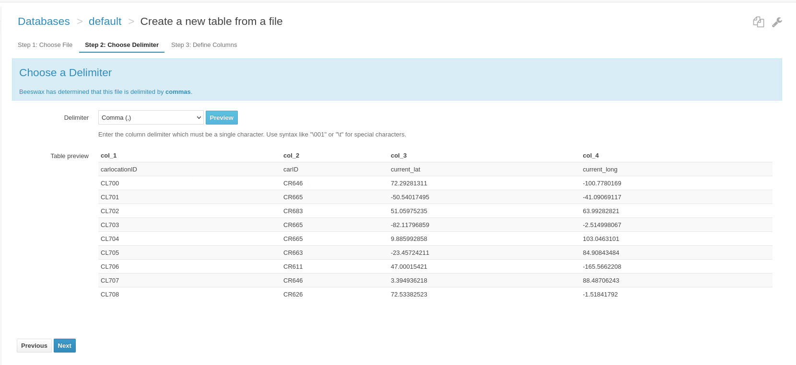

# UBER : Using HIVE Schema
## Section: I Introduction
**Introduction to Apache Hive**

Apache Hive is a robust data warehousing solution built atop the Hadoop ecosystem, originally developed by Facebook. Hive facilitates easy querying, data summarization, and analysis of vast datasets distributed across a Hadoop environment. It converts SQL-like queries, known as HiveQL, into MapReduce jobs, making it ideal for SQL-knowledgeable users transitioning into big data roles.

**Overview of Apache Hive**

Hive is tailored for handling structured data on HDFS (Hadoop Distributed File System) and excels at scalable data processing. While Hive is not geared towards real-time querying, it is highly effective for batch processing large volumes of data. Its SQL-like interface allows for complex analytical queries, which makes Hive a fundamental tool in big data analytics.

**Relevance to Big Data**

Handling big data involves challenges like managing large volumes of data, ensuring quick data processing, and accommodating various data types. Hive addresses these through its ability to manage petabytes of data and its scalable architecture, which supports efficient parallel processing across multiple servers.

**Purpose of Implementing RDBMS Schema in Hive**

The project's goal is to translate a traditional RDBMS schema into Apache Hive, providing a hands-on exploration of Hive's data warehousing capabilities within a big data context. This exercise is crafted to yield comprehensive learning outcomes

**Schema Adaptation and Optimization:**

**Transition from RDBMS to Hive:** We aim to understand how relational schemas can be adapted for big data environments, including necessary modifications for Hive optimization. 

**Optimization Techniques:**
We will explore strategies such as partitioning and bucketing, which are crucial for improving data management and query performance in Hive.


**Leveraging SQL-like Capabilities in Big Data:**

Utilizing HiveQL will demonstrate the convergence of traditional SQL skills with big data technologies, easing the transition for those familiar with conventional databases and enhancing our strategic capabilities in data manipulation and query formulation.

**Performance and Scalability Analysis**

A thorough comparison of Hive’s performance with traditional RDBMS and Apache Cassandra will highlight the distinct advantages and potential limitations of Hive in handling large-scale data sets, focusing on scalability, efficiency, and throughput.

**Hands-on Data Warehousing Experience:**

The project serves as a practical application of data warehousing principles in the context of big data, preparing us for real-world scenarios where large-scale data management, processing, and analytics are crucial.

Through this project, we aim to replicate and enhance the structured data model from traditional databases in Hive, deepening our understanding of big data operations and improving our skills in data architecture for advanced data-driven decision-making.

## Section: II Schema Implementation in Hive

File needs to be added in to HDFS 

### Implementing RDBMS schema into Hive
When moving from a traditional RDBMS to Hive, it's essential to get acquainted with the Hive ecosystem and its query language, HiveQL. In this section, the concentration was on setting up the Passenger table as an example to demonstrate how to implement a typical table structure within Hive.

#### Create Table :Passenger
Process Overview:

**Defining the Schema:** We started by identifying the necessary columns and data types based on our RDBMS schema. In the Hive context, we need to consider the data types that Hive supports, which might differ slightly from traditional SQL databases.

**Table Creation:** Using the Hive interface, we defined the Passenger table. Here's the HiveQL statement that encapsulates our table definition

```
CREATE TABLE IF NOT EXISTS Passenger (
    requestID STRING,
    ride_type STRING,
    pickup_lat FLOAT,
    pickup_long FLOAT,
    pickup_address STRING,
    drop_lat FLOAT,
    drop_long FLOAT,
    seats TINYINT,
    userID STRING
)
ROW FORMAT DELIMITED
FIELDS TERMINATED BY ','
STORED AS TEXTFILE;

```
This statement sets up a table that matches the columns of the RDBMS schema. We have chosen a text-based storage format, using commas as delimiters, which is frequently used for importing data from CSV files.

**Importing Data:**  With the structure in place, we imported the data from a CSV file into Hive. The interface allowed us to specify the delimiter and preview the data import to ensure accuracy.

**Verification:** After importing the data, we executed sample queries to validate the integrity and correctness of the data within the Passenger table.

**Challenges Overcome:**

One challenge was ensuring that the data types chosen in HiveQL matched the data from our CSV file. Incorrect data types can result in errors or loss of precision.
Another was dealing with the nuances of Hive's data import mechanisms, particularly the handling of different file formats and delimiters.


**Passenger**

[Passenger Data File](data/Passenger.csv)


**Car**

[Car Data File](data/Car.csv)


**Car Location**

[Car Location Data File](data/CarLocation.csv)





**Driver**

[Driver Data File](data/Driver.csv)


**Request**

[Request Data File](data/Request.csv)


**Request To Driver**

[Request To Driver Data File](data/Request_to_Driver.csv)


**Trip**

[Trip Data File](data/Trip.csv)


#### Alter Table

Query to add clusting buckets for passenger table

```
ALTER TABLE Passenger CLUSTERED BY (userID)
INTO 10 BUCKETS;
```

### HiveQL statements
Q1 Book a request to drivers 

Assumption: Below variable definitions come from the app

```
-- Inserting Data in Request Table
INSERT INTO TABLE Request VALUES ('REQ304',  'Uber Green', 40.000023459, -75.000023459,'11112 Sage Canyon Dr', 100.000023459, -75.000023459, 5,'PAS101');

SELECT * FROM Request where requestid='REQ304'
```


Q2 Update Driver response 

Q3 Update Car location

Q4 Find Nearest Car
```
SET hivevar:pax_lat = 72.0;
SET hivevar:pax_long = -100.0;
SET hivevar:Range = 20.0;

SELECT cc.ubertype,
       MIN(ACOS(SIN(RADIANS(${hivevar:pax_lat})) * SIN(RADIANS(cl.current_lat)) +
                COS(RADIANS(${hivevar:pax_lat})) * COS(RADIANS(cl.current_lat)) *
                COS(RADIANS(cl.current_long) - RADIANS(${hivevar:pax_long})))) * 3958.756 AS distance_to_pax
FROM CarLocation cl
JOIN Car cc ON cc.car_id = cl.carid
WHERE cl.current_lat BETWEEN (${hivevar:pax_lat} - ${hivevar:Range}) AND (${hivevar:pax_lat} + ${hivevar:Range})
  AND cl.current_long BETWEEN (${hivevar:pax_long} - ${hivevar:Range}) AND (${hivevar:pax_long} + ${hivevar:Range})
GROUP BY cc.ubertype;
```


Q5  Recommend most common pickup locations across all trips

Q6 Get driver earnings report for a day or date range

**Modifications and Rationale**

**Partitioning** helps in optimizing query performance by reducing the amount of data scanned during query execution.

**Bucketing**  improves join performance, a common operation in data warehousing by clustering data that will frequently be queried together.


## Section: III Data Manipulation and Querying

### HiveQL queries to perform data insertion, updating, deletion, and retrieval

## Section: IV Performance Considerations

In transitioning the RDBMS schema to Apache Hive, evaluating performance considerations is crucial. Hive, structured atop Hadoop, offers unique advantages and challenges when it comes to processing and managing big data. Here are the key performance factors we examined:

**Query Execution Time:**

**Batch Processing vs. Real-Time:** Hive is optimized for batch processing rather than real-time query execution. We analyzed the response times of typical queries and observed that while Hive handles complex analytical queries across large datasets efficiently, it is slower compared to traditional RDBMS for quick, transactional queries.

**Effect of Partitioning and Bucketing:** Implementing partitioning and bucketing significantly improved query performance by minimizing the amount of data read during query execution. This was particularly noticeable in data-heavy operations such as joins and aggregations.

**Data Throughput:**

**Handling Large Volumes:** One of Hive's strengths is its ability to process large volumes of data. We tested data throughput under various scenarios to determine how well Hive performs under load, especially when compared to RDBMS and Cassandra. Hive's performance shines in scenarios involving massive datasets that are well-partitioned.

**Resource Utilization:**

**MapReduce Efficiency:** Hive queries translate into MapReduce jobs, and thus the efficiency of these jobs heavily influences overall performance. We explored optimizations such as tuning the number of mappers and reducers to enhance resource utilization.

**Comparison with RDBMS and Cassandra:**

**Scalability:** Unlike RDBMS systems, which may struggle with horizontal scaling, Hive scales out effectively due to its Hadoop backbone.

**Write Efficiency:** While Cassandra excels in write-heavy scenarios due to its design, Hive is less efficient in this respect but offers superior capabilities for complex analytical tasks over large datasets.

## Section: V Challenges and Learnings
The project of implementing an RDBMS schema in Hive was both challenging and enlightening. Here are some of the key challenges we faced and the learnings we derived from them:

**Schema Translation Complexity:**

**Challenge:** Adapting relational schemas to fit Hive's model required thoughtful consideration, especially in deciding how to handle data normalization and denormalization.

**Learning:** We learned the importance of schema design in big data environments and how strategic decisions like partitioning can impact performance.

**Query Optimization:**

**Challenge:** Optimizing HiveQL queries for performance required a different approach compared to traditional SQL queries.

**Learning:** We gained practical experience in writing efficient HiveQL and understanding the underlying mechanics of how Hive processes these queries.

**Handling Updates and Deletes:**

**Challenge:** Hive’s traditional limitations on transactional features like updates and deletes posed difficulties.

**Learning:** We explored Hive’s newer capabilities, such as ACID transactions and Merge statements, to handle data modifications more effectively.

## Section: VI Conclusion

The project allowed us to deeply explore Apache Hive's capabilities and limitations within the context of big data warehousing. The hands-on experience has been invaluable in teaching us about the architectural considerations and performance optimizations necessary for effectively utilizing Hive in real-world data warehousing scenarios.

**Insights Gained:** We have come to appreciate Hive's role in big data analytics, particularly its robust handling of large-scale data analysis and its integration with the Hadoop ecosystem.

**Real-world Applications:**  The knowledge gained through this project enhances our ability to design and implement data solutions that are scalable, efficient, and suitable for the evolving needs of businesses handling large volumes of data.

**Comparative Reflection:** Comparing Hive with Cassandra and traditional RDBMS has provided us with a broader perspective on data management technologies, informing our future choices in selecting the right tool for specific data scenarios.

In conclusion, the project not only reinforced our understanding of data warehousing principles but also prepared us to tackle complex data challenges in our future careers, leveraging Apache Hive and other big data technologies

## Section: VII Appendix
