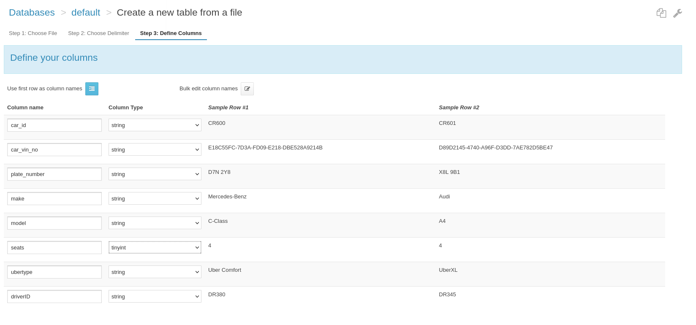
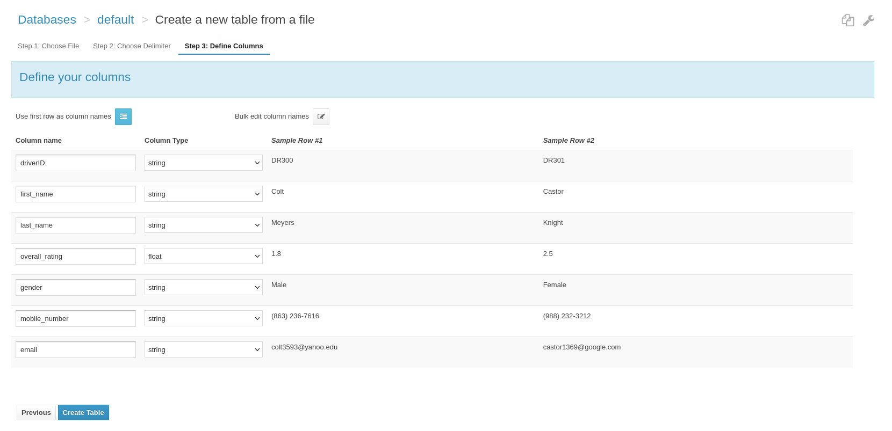
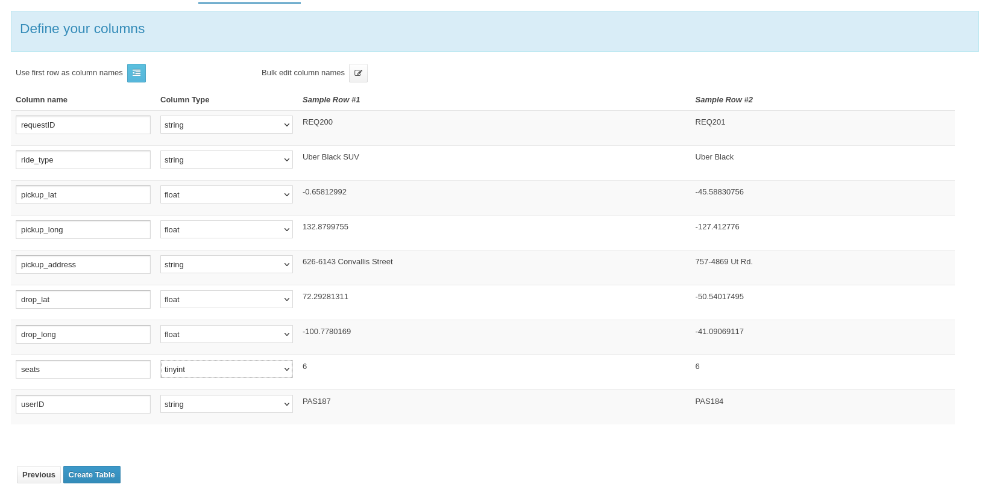

# UBER Ride Sharing App (Hive Approach)
## Section: I Introduction
**Introduction to Apache Hive**

Apache Hive is a robust data warehousing solution built atop the Apache Hadoop ecosystem, originally developed by Facebook (2008). Hive facilitates easy querying, data summarization, and analysis of vast datasets distributed across a Hadoop Distributed File System. HiveQL syntactically is similar to SQL allowing SQL-knowledgeable users to transition into big data roles. HiveQL converts the queries into MapReduce jobs, making it ideal for querying data in distributed environment.  

**Overview of Apache Hive**

Hive is tailored for handling structured data on HDFS (Hadoop Distributed File System) and excels at scalable data processing. While Hive is not geared towards real-time querying, it is highly effective for batch processing large volumes of data. Its SQL-like interface allows for complex analytical queries, which makes Hive a fundamental tool in big data analytics.

**Relevance to Big Data**

Handling big data involves challenges like managing large volumes of data, ensuring quick data processing, and accommodating various data types. Hive addresses these through its ability to manage petabytes of data and its scalable architecture, which supports efficient parallel processing across multiple servers.

**Purpose of Implementing RDBMS Schema in Hive**

The project's goal is to translate a traditional RDBMS schema into Apache Hive, providing a hands-on exploration of Hive's data warehousing capabilities using Cloudera supported Hive environment.

**Schema Adaptation and Optimization:**

**Transition from RDBMS to Hive:** The transition to Apache HiveQL does not require a steep learning curve as the Hive Query Language is similar to Structure Query Language with few exceptions. The specialized functions of SQL are not supported in Hive. For instance, SELECT TOP 10 From TableName does not have a parallel in Hive, or when it comes to updating the data in HiveQL one essentially replaces entire tables or partitions with updated data, like INSERT OVERWRITE to replace the existing table/partition with data from your staging table.

**Optimization Techniques:**
We will explore strategies such as partitioning and bucketing, which are crucial for improving data management and query performance in Hive.


**Leveraging SQL-like Capabilities in Big Data:**

Utilizing HiveQL will demonstrate the convergence of traditional SQL skills with big data technologies, easing the transition for those familiar with conventional databases and enhancing our strategic capabilities in data manipulation and query formulation.

**Performance and Scalability Analysis**

A thorough comparison of Hive’s performance with traditional RDBMS and Apache Cassandra will highlight the distinct advantages and potential limitations of Hive in handling large-scale data sets, focusing on scalability, efficiency, and throughput.

**Hands-on Data Warehousing Experience:**

The project serves as a practical application of data warehousing principles in the context of big data, preparing us for real-world scenarios where large-scale data management, processing, and analytics are crucial.

Through this project, we aim to replicate and enhance the structured data model from traditional databases in Hive, deepening our understanding of big data operations and improving our skills in data architecture for advanced data-driven decision-making.

## Section: II Schema Implementation in Hive

File needs to be added in to HDFS 

### Implementing RDBMS schema into Hive
When moving from a traditional RDBMS to Hive, it's essential to get acquainted with the Hive ecosystem and its query language, HiveQL. In this section, the concentration was on setting up the Passenger table as an example to demonstrate how to implement a typical table structure within Hive.

#### Table: Passenger

**Process Outline:**

**Defining the Schema:** We started by identifying the necessary columns and data types based on our RDBMS schema. In the Hive context, we need to consider the data types that Hive supports, which might differ slightly from traditional SQL databases.

**Table Creation:** Using the Hive interface, we defined the Passenger table. Here's the HiveQL statement that encapsulates our table definition

```
CREATE TABLE Passenger (
    requestID STRING,
    ride_type STRING,
    pickup_lat FLOAT,
    pickup_long FLOAT,
    pickup_address STRING,
    drop_lat FLOAT,
    drop_long FLOAT,
    seats TINYINT,
    userID STRING
)
ROW FORMAT DELIMITED
FIELDS TERMINATED BY ','
STORED AS TEXTFILE;

```
This statement sets up a table that matches the columns of the RDBMS schema. We have chosen a text-based storage format, using commas as delimiters, which is frequently used for importing data from CSV files.

**Importing Data:**  With the structure in place, we imported the data from a CSV file into Hive. The interface allowed us to specify the delimiter and preview the data import to ensure accuracy.

[Passenger Data File](data/Passenger.csv)


**Alter Table**
Query to add clusting buckets for passenger table

```
ALTER TABLE passenger CLUSTERED BY (userID)
INTO 10 BUCKETS;
```

**Verification:** After importing the data, we executed sample queries to validate the integrity and correctness of the data within the Passenger table.

**Challenges Overcome:**

One challenge was ensuring that the data types chosen in HiveQL matched the data from our CSV file. Incorrect data types can result in errors or loss of precision.

Another was dealing with the nuances of Hive's data import mechanisms, particularly the handling of different file formats and delimiters.

#### Table: Car


**Process Outline:**
This step is a pivotal transition from theory to practice in managing structured data within a big data ecosystem.

**Defining the Table:**
The Car table was conceived to encapsulate the various attributes of vehicles in our dataset. We commenced by defining the schema in the Hive Metastore, specifying column names and types that reflect our data model.

**Table Creation in HiveQL:**
Leveraging HiveQL, we executed the following statement to create the Car table, with consideration for Hive's data types and the nature of our data

```
CREATE TABLE Car (
    car_id STRING,
    car_vin_no STRING,
    plate_number STRING,
    make STRING,
    model STRING,
    seats TINYINT,
    ubertype STRING,
    driverID STRING
)
ROW FORMAT DELIMITED
FIELDS TERMINATED BY ','
STORED AS TEXTFILE;
```
This creates a new table with a structure ready to accommodate the CSV data we intended to import, denoting a comma as the field delimiter consistent with our data format.

**Data Import:**
With the structure in place, we initiated the data import process by selecting the CSV file from HDFS. This file was pre-validated to ensure compatibility with our table's schema, both in terms of content and format.

[Car Data File](data/Car.csv)




**Alter Table**
Query to add clusting buckets for car table

```
ALTER TABLE car CLUSTERED BY (car_id)
INTO 10 BUCKETS;
```

**Data Verification:**
Post-import, we conducted a series of queries to confirm the integrity and accuracy of the data. This step was essential to ensure that the data loaded into Hive was free from any import-related anomalies.

**Challenges Encountered:**

**Schema Mapping:** Aligning the CSV data types with those available in Hive required careful consideration to avoid data type mismatches that could lead to errors during data loading.

**Data Validation:** Ensuring that the imported data is correctly representing the original source necessitated a meticulous validation process.

#### Table: Car Location

**Process Outline:**

Here we  focus on constructing the CarLocation table within the Hive data warehouse. This process underscores our ability to translate and manage geospatial data, crucial for dynamic querying and analytics within our domain.

**Schema Design:**
We began by crafting a schema that captures the real-time locations of cars, essential for tracking and deployment in transportation networks. The design process involved defining the table's structure to include identifiers and geographic coordinates.

**HiveQL Table Definition:**
We formulated the following HiveQL command to define the CarLocation table
```
CREATE TABLE CarLocation (
    carlocationID STRING,
    carID STRING,
    current_lat FLOAT,
    current_long FLOAT
)
ROW FORMAT DELIMITED
FIELDS TERMINATED BY ','
STORED AS TEXTFILE;

```
This command constructs a table ready to ingest the location data, with each field delineated by a comma, in keeping with the CSV format of our incoming data file.

**Data Import from CSV:**
The subsequent stage involved importing the location data from a CSV file housed in HDFS. This process is streamlined by the Hive interface, which simplifies data loading while ensuring the fidelity of the data to our defined schema.

[Car Location Data File](data/CarLocation.csv)


**Alter Table**
Query to add clusting buckets for carLocation table

```
ALTER TABLE carLocation CLUSTERED BY (carid)
INTO 10 BUCKETS;
```

**Validation and Integrity Checks:**
Post-import, we engaged in rigorous data validation efforts, querying the CarLocation table to verify the consistency and accuracy of the data importation process.

**Rationale and Considerations:**

1. Selecting TEXTFILE for storage was influenced by the direct import from a CSV format and allows for straightforward data debugging and manual review if needed.

2. The data types chosen, such as STRING for identifiers and FLOAT for latitude and longitude, accommodate the necessary precision for geospatial data without incurring the storage overhead of more complex types.

3. The use of commas to separate fields reflects our CSV source file, ensuring congruence between the data format and Hive's expectations.

**Challenges Addressed:**

**Geospatial Data Handling:** One of the challenges we navigated was the effective representation and storage of geospatial data, which often requires precise data types and storage considerations.

**Data Import Workflow:** Importing data from CSV and ensuring its correctness in Hive presented a learning curve, necessitating attention to detail in schema mapping and data transformation.

#### Table: Driver

The Driver table is a key part of our transportation data model in Hive, designed to store detailed information about drivers, crucial for both operational management and analytical purposes.

**Process Outline:**

**Designing the Schema:**
We identified the essential attributes of a driver that need to be captured, based on our RDBMS schema and the nature of the queries we anticipate.

**HiveQL Table Definition:**
The following HiveQL statement was crafted to define the Driver table in our Hive database.

```
CREATE TABLE Driver (
    driverID STRING,
    first_name STRING,
    last_name STRING,
    overall_rating FLOAT,
    gender STRING,
    mobile_number STRING,
    email STRING
)
ROW FORMAT DELIMITED
FIELDS TERMINATED BY ','
STORED AS TEXTFILE;
```
This HiveQL command outlines the structure of the Driver table, indicating the use of commas as field separators, in line with the CSV format of our data.

**Data Import from CSV:**

We proceeded with the data import process by selecting our CSV file located within the HDFS, specifying the file path and ensuring that the import data checkbox was selected. This imports the data into the Driver table post-creation.

[Driver Data File](data/Driver.csv)




**Alter Table**
Query to add clusting buckets for driver table

```
ALTER TABLE driver CLUSTERED BY (driverid)
INTO 10 BUCKETS;
```

**Data Verification:**
After the import was completed, a series of data integrity checks were performed. We ran sample queries to ensure that the data was accurately reflected in Hive and that there were no discrepancies from the source CSV.

**Rationale for Data Types and Structure:**

1. We chose STRING for most fields to ensure that all textual data, including potentially alphanumeric identifiers, are accurately captured.
   
2. FLOAT was selected for the overall_rating to represent driver ratings with decimal precision.
   
3. The use of TEXTFILE format facilitates straightforward inspection and debugging of raw data.


**Challenges Encountered:**

**Ensuring Data Type Compatibility:**  Matching the CSV data types with those supported by Hive and ensuring accurate data representation was a key challenge.

**Data Quality Assurance:**  Post-import, we needed to validate the data quality, which included checking for any import errors or data corruption.

#### Table: Request

This table is pivotal for tracking user requests and managing the dispatch system within our transportation data model.

**Process Outline:**

**Schema Definition:**

We drafted a schema that details user ride requests, incorporating fields for identification, ride type, pickup and drop-off coordinates, and other relevant information.

**HiveQL Table Construction:**
We used the following HiveQL statement to create the Request table, which aligns with our designated data structure

```
CREATE TABLE Request (
    requestID STRING,
    ride_type STRING,
    pickup_lat FLOAT,
    pickup_long FLOAT,
    pickup_address STRING,
    drop_lat FLOAT,
    drop_long FLOAT,
    seats TINYINT,
    userID STRING
)
ROW FORMAT DELIMITED
FIELDS TERMINATED BY ','
STORED AS TEXTFILE;

```
This command defines the table in Hive with the appropriate data types and designates a comma as the field separator.

**CSV Data Import:**

We imported the data from our CSV file located in the HDFS. The file path was specified, and the import data option was checked to ensure that the table was populated with the incoming data.

[Request Data File](data/Request.csv)




**Alter Table**
Query to add clusting buckets for request table

```
ALTER TABLE Request CLUSTERED BY (requestid)
INTO 10 BUCKETS;
```

**Data Integrity Assurance:**

Post-import, we executed validation queries against the Request table. This step confirmed the accurate representation of our data within Hive and ensured that the import was successful without any loss or corruption of data.


**Rationale for Data Types and Structure:**

1. The STRING type was chosen for identifiers and addresses to handle variable-length text.
   
2.  FLOAT was selected for latitude and longitude to accommodate geographic coordinates with the required precision.
 
3. TINYINT is suitable for the number of seats, which would typically be a small number and doesn't necessitate a larger integer type.

**Challenges Addressed:**

**Schema-Data Compatibility:** Careful mapping between the schema and the CSV data was crucial to prevent type mismatches and data import errors.

**Data Quality Verification:**  After the data import, we meticulously verified the quality to ensure it met our accuracy standards. 

#### Table: Request To Driver

 The Request_to_Driver table forms a key link between the service requests by users and the drivers who fulfill them. This table is essential for understanding and optimizing the assignment process in our transportation model.

**Process Outline:**

**Schema Designing:**

This table is designed to track which driver accepted which request. Fields include unique identifiers for the request, the driver, and a status indicator for acceptance.

**HiveQL Table Definition:**
We crafted the following HiveQL statement to accurately define the Request_to_Driver table

```
CREATE TABLE Request_to_Driver (
    requestdriverID STRING,
    driverID STRING,
    requestID STRING,
    is_accepted BOOLEAN
)
ROW FORMAT DELIMITED
FIELDS TERMINATED BY ','
STORED AS TEXTFILE;

```
This creates a Hive table structured to capture relationships between ride requests and drivers, facilitating the analysis of driver response patterns and request fulfillment rates.

**CSV Data Loading:**
We loaded the data from a CSV file, ensuring each column corresponded correctly to the data types defined in the Hive table.

[Request To Driver Data File](data/Request_to_Driver.csv)


**Alter Table**
Query to add clusting buckets for request to driver table

```
ALTER TABLE request_to_driver CLUSTERED BY (requestid)
INTO 10 BUCKETS;
```

**Data Integrity Validation:**

Following the import, we conducted data integrity checks by querying the table. This step is crucial for ensuring that the imported data is accurate and properly formatted, reflecting true associations between requests and drivers.

**Considerations and Rationale:**

1.The STRING data type for identifiers provides the flexibility to handle alphanumeric data which is often used in real-world applications for IDs.

2.The BOOLEAN type for the is_accepted field allows us to store true/false values effectively, representing whether a driver has accepted a request.

**Challenges Tackled:**

**Complex Data Relationships:**  Ensuring that the data imported reflects the many-to-many relationships inherent in ride requests and driver assignments.

**Data Type Mappings:**  Mapping the boolean values correctly from CSV to Hive, given that CSV does not have a native boolean type, required some preprocessing of the data.

#### Table: Trip

This table is a significant entity that holds detailed records of each trip, encompassing aspects such as timings, duration, ratings, and fare, which are critical for operational analysis and financial reporting.

**Process Overview:**

**Table Schema Definition:**

We drafted a schema for the Trip table that captures a broad spectrum of trip-related data, designed to facilitate deep analytics on trip efficiency, driver performance, and revenue generation.

**HiveQL Table Construction:**

The following HiveQL statement was formulated for defining the Trip table

```
CREATE TABLE Trip (
    trip_id STRING,
    trip_date DATE,
    duration STRING,
    driver_rating INT,
    passenger_rating INT,
    driver_id STRING,
    request_id STRING,
    total_fare DOUBLE
)
ROW FORMAT DELIMITED
FIELDS TERMINATED BY ','
STORED AS TEXTFILE;

```
This command is tailored to match our data structure, ensuring the field types are compatible with the data we will be importing from the CSV file.

**Data Import from CSV:**
We imported the trip data from the CSV file located in the HDFS, using Hive's data import functionality that matches the columns of our CSV with the table schema we defined.

[Trip Data File](data/Trip.csv)


**Alter Table**
Query to add clusting buckets for trip table

```
ALTER TABLE trip CLUSTERED BY (trip_id)
INTO 10 BUCKETS;
```

**Data Validation:**
Post-import, validation queries were performed against the Trip table to ensure the integrity and completeness of the data imported into Hive.

**Considerations and Rationale:**

1. STRING data type was chosen for trip_id, start_time, and request_id to accurately capture alphanumeric identifiers and timestamps.
   
2. INT and DOUBLE data types for ratings and fare, respectively, were selected to reflect the quantitative nature of this data while preserving precision for analytics.
   
**Challenges Encountered:**

**Complex Data Formatting:** Dealing with various data formats, particularly for timestamps and duration, required careful planning during the import process.

**Accuracy in Financial Data:** Ensuring that the total fare amounts were correctly imported and represented in Hive, given their importance for revenue analysis.

### HiveQL statements

**Q1 Book a request to drivers** 

Assumption: Below variable definitions come from the app

````sql
SET hivevar:requestId = 'REQ304';
SET hivevar:paxId = 'PAS101';
SET hivevar:requestdriverid1 = 'REQ304DR201';
SET hivevar:requestdriverid2 = 'REQ304DR202';
SET hivevar:driverid1 = 'DR201';
SET hivevar:driverid2 = 'DR202';


INSERT INTO TABLE Request VALUES (${hivevar:requestId}, 'Uber Green', 40.000023459, -75.000023459,
'11112 Sage Canyon Dr', 100.000023459, -75.000023459, 5,${hivevar:paxId});

INSERT INTO TABLE Request_to_driver VALUES (${hivevar:requestdriverid1},${hivevar:driverid1}, ${hivevar:requestId},false);

INSERT INTO TABLE Request_to_driver VALUES (${hivevar:requestdriverid2},${hivevar:driverid1}, ${hivevar:requestId},false);
````


````sql
select * from Request_to_driver where requestdriverid in ('REQ304DR202','REQ304DR201')
````


**Modifications and Rationale**

**Partitioning** helps in optimizing query performance by reducing the amount of data scanned during query execution.

**Bucketing**  improves join performance, a common operation in data warehousing by clustering data that will frequently be queried together.


## Section: III Data Manipulation and Querying

**Q2: Update Driver response** 

````sql
insert overwrite table request_to_driver 
select requestdriverid,driverid,requestid, 
case when requestdriverid ='REQ304DR201' then true else is_accepted end as is_accepted
from request_to_driver ;
````

````sql
select * from Request_to_driver where requestdriverid = 'REQ304DR201'
````


**Q3: Find Nearest Car**

````sql
SET hivevar:pax_lat = 72.0;
SET hivevar:pax_long = -100.0;
SET hivevar:Range = 20.0;

SELECT cc.ubertype,
       MIN(ACOS(SIN(RADIANS(${hivevar:pax_lat})) * SIN(RADIANS(cl.current_lat)) +
                COS(RADIANS(${hivevar:pax_lat})) * COS(RADIANS(cl.current_lat)) *
                COS(RADIANS(cl.current_long) - RADIANS(${hivevar:pax_long})))) * 3958.756 AS distance_to_pax
FROM CarLocation cl
JOIN Car cc ON cc.car_id = cl.carid
WHERE cl.current_lat BETWEEN (${hivevar:pax_lat} - ${hivevar:Range}) AND (${hivevar:pax_lat} + ${hivevar:Range})
  AND cl.current_long BETWEEN (${hivevar:pax_long} - ${hivevar:Range}) AND (${hivevar:pax_long} + ${hivevar:Range})
GROUP BY cc.ubertype;
````


**Q4: Recommend most common pickup locations across all trips**

````sql
select pickup_address,count(*) as total_request from request group by pickup_address order by total_request desc LIMIT 1;
````


**Q5: Get driver earnings report for a day or date range**

````sql
SET hivevar:requestDate = '2024-02-23';
SET hivevar:driverId = 'DR356';

select trip_date,driver_id, sum (total_fare) as totalEarnings from trip 
where driver_id=${hivevar:driverId} and trip_date = ${hivevar:requestDate} 
group by driver_id,trip_date;
````


### HiveQL queries to perform data insertion, updating, deletion, and retrieval

## Section: IV Performance Considerations

In transitioning the RDBMS schema to Apache Hive, evaluating performance considerations is crucial. Hive, structured atop Hadoop, offers unique advantages and challenges when it comes to processing and managing big data. Here are the key performance factors we examined:

**Query Execution Time:**

**Batch Processing vs. Real-Time:** Hive is optimized for batch processing rather than real-time query execution. We analyzed the response times of typical queries and observed that while Hive handles complex analytical queries across large datasets efficiently, it is slower compared to traditional RDBMS for quick, transactional queries.

**Effect of Partitioning and Bucketing:** Implementing partitioning and bucketing significantly improved query performance by minimizing the amount of data read during query execution. This was particularly noticeable in data-heavy operations such as joins and aggregations.

**Data Throughput:**

**Handling Large Volumes:** One of Hive's strengths is its ability to process large volumes of data. We tested data throughput under various scenarios to determine how well Hive performs under load, especially when compared to RDBMS and Cassandra. Hive's performance shines in scenarios involving massive datasets that are well-partitioned.

**Resource Utilization:**

**MapReduce Efficiency:** Hive queries translate into MapReduce jobs, and thus the efficiency of these jobs heavily influences overall performance. We explored optimizations such as tuning the number of mappers and reducers to enhance resource utilization.

**Comparison with RDBMS and Cassandra:**

**Scalability:** Unlike RDBMS systems, which may struggle with horizontal scaling, Hive scales out effectively due to its Hadoop backbone.

**Write Efficiency:** While Cassandra excels in write-heavy scenarios due to its design, Hive is less efficient in this respect but offers superior capabilities for complex analytical tasks over large datasets.

## Section: V Challenges and Learnings
The project of implementing an RDBMS schema in Hive was both challenging and enlightening. Here are some of the key challenges we faced and the learnings we derived from them:

**Schema Translation Complexity:**

**Challenge:** Adapting relational schemas to fit Hive's model required thoughtful consideration, especially in deciding how to handle data normalization and denormalization.

**Learning:** We learned the importance of schema design in big data environments and how strategic decisions like partitioning can impact performance.

**Query Optimization:**

**Challenge:** Optimizing HiveQL queries for performance required a different approach compared to traditional SQL queries.

**Learning:** We gained practical experience in writing efficient HiveQL and understanding the underlying mechanics of how Hive processes these queries.

**Handling Updates and Deletes:**

**Challenge:** Hive’s traditional limitations on transactional features like updates and deletes posed difficulties.

**Learning:** We explored Hive’s newer capabilities, such as ACID transactions and Merge statements, to handle data modifications more effectively.

## Section: VI Conclusion

The project allowed us to deeply explore Apache Hive's capabilities and limitations within the context of big data warehousing. The hands-on experience has been invaluable in teaching us about the architectural considerations and performance optimizations necessary for effectively utilizing Hive in real-world data warehousing scenarios.

**Insights Gained:** We have come to appreciate Hive's role in big data analytics, particularly its robust handling of large-scale data analysis and its integration with the Hadoop ecosystem.

**Real-world Applications:**  The knowledge gained through this project enhances our ability to design and implement data solutions that are scalable, efficient, and suitable for the evolving needs of businesses handling large volumes of data.

**Comparative Reflection:** Comparing Hive with Cassandra and traditional RDBMS has provided us with a broader perspective on data management technologies, informing our future choices in selecting the right tool for specific data scenarios.

In conclusion, the project not only reinforced our understanding of data warehousing principles but also prepared us to tackle complex data challenges in our future careers, leveraging Apache Hive and other big data technologies

## Section: VII Appendix
